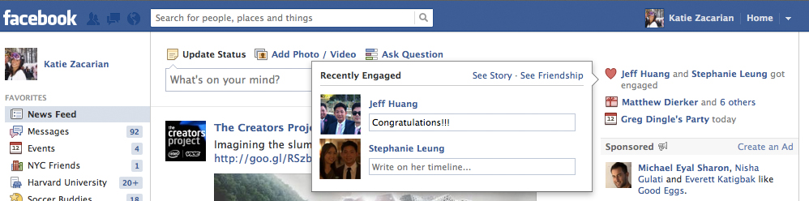

Would it be nice to wish your friends on their weddings or engagements with just a single click, just like the current Birthday feature on Facebook? Now, the company released a new “Weddings and Celebrations” feature that will display special events, starting with weddings and engagements, along with friends’ birthdays. It works just like birthday feature which shows up in the top right side of page when you log in.

\[[Credit](http://www.flickr.com/photos/vphotography/482971590/sizes/z/in/photostream/)\]

 Facebook spokesperson told [TNW](http://thenextweb.com/facebook/2012/07/12/wedding-and-engagement-news-now-get-the-birthday-treatment-on-facebook/) -

> _Facebook has become a unique way people share and congratulate friends around exciting life events such as engagements and weddings or the arrival of a child. To make it easier to keep up with these momentous occasions and to ensure you can share in your friends’ joy, we are rolling out a “Weddings and Celebrations” feature. Beginning today, special events starting with engagements and weddings will be displayed along with friends’ birthdays when you log into Facebook._

This feature comes after Facebook [rolled out](https://twitter.com/k_avinash/status/223207642699534337) new Calendar view for Events page yesterday. Instead of waiting to see this feature on your Facebook or if none of your friends has plan to tie the knot anytime soon, here is how it looks like (click the image for bigger view), courtesy of TNW:

 

Now, whenever someone changes their relationship status to engaged or married, it will set off the notification. However, writing “Congrats!” or “Wait, really?” without visiting their profile is up to you! And probably won’t get you off the hook for buying a wedding present!

How do you feel about Facebook promoting these new life events?
