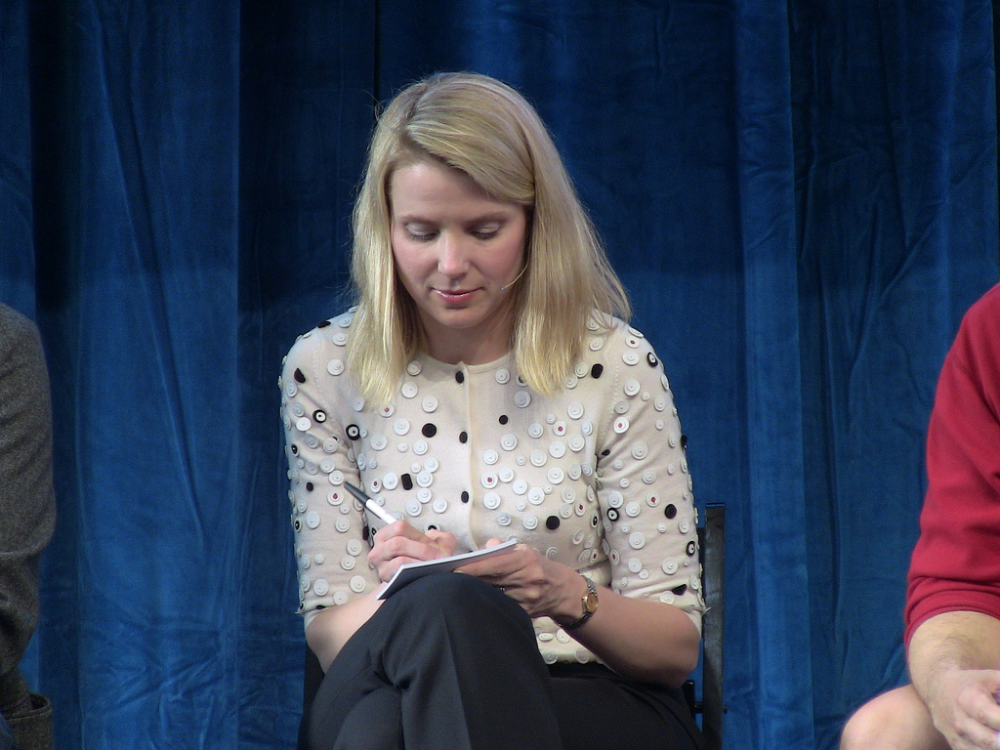

Yesterday, Google's first female engineer, Marissa Mayer, resigned. After spending 13 years at Google, she begins her career as Yahoo's new CEO at the age of 37.

She is 'product focused' and focused on the 'user experience'. She is good at mentoring talent. At Google, she was responsible for Google's popular products: the simple white search homepage, Gmail, Google News, and Google Images.

\[[Credit](http://www.flickr.com/photos/jolieodell/4524497781/sizes/l/in/photostream/)\]

Not familiar with this newly appointmented CEO? Here are some of the interesting things to know about Marissa with some inputs from [GeekSugar](http://www.geeksugar.com/Facts-About-Marissa-Mayer-Yahoo-CEO-24016600):

> 1.  She was accepted into every college she applied to (about 10 schools). She ultimately chose Stanford.
> 2. When she graduated from Stanford, she received 14 job offers. She joined Google in June 1999 as a software engineer.
> 3. Marissa originally wanted to become a pediatric neurosurgeon.
> 4. She wasn't a computer geek until college and when she bought her first computer.
> 5. During her career at Google, she has been an engineer, designer, product manager, and executive and launched more than 100 features and products.
> 6. Recently, she was Google's Vice President, Local, Maps & Location Services.
> 7. In addition to her work for Google, Mayer also serves on Wal-Mart's board of directors.
> 8. Her advice on being a woman in a male-dominated tech industry: “Work with the smartest people you can find, do something you’re not ready to do, find an environment in which you’re very comfortable so you can find your voice, and work for someone who believes in you — because when they believe in you, they’ll invest in you.”
> 9. She married real estate investment manager Zack Bogue in 2009.
> 10. Bonus - Marissa and her husband Zach are expecting their first child in this October and she just tweeted after her new CEO appointment news. Congratulations!

Here is one of the interesting videos of Marissa at LeWeb 2011 as VP of product management describing Google+ -

<iframe src="http://www.youtube.com/embed/tIYfnMx8CMM" frameborder="0" width="640" height="360"></iframe>
