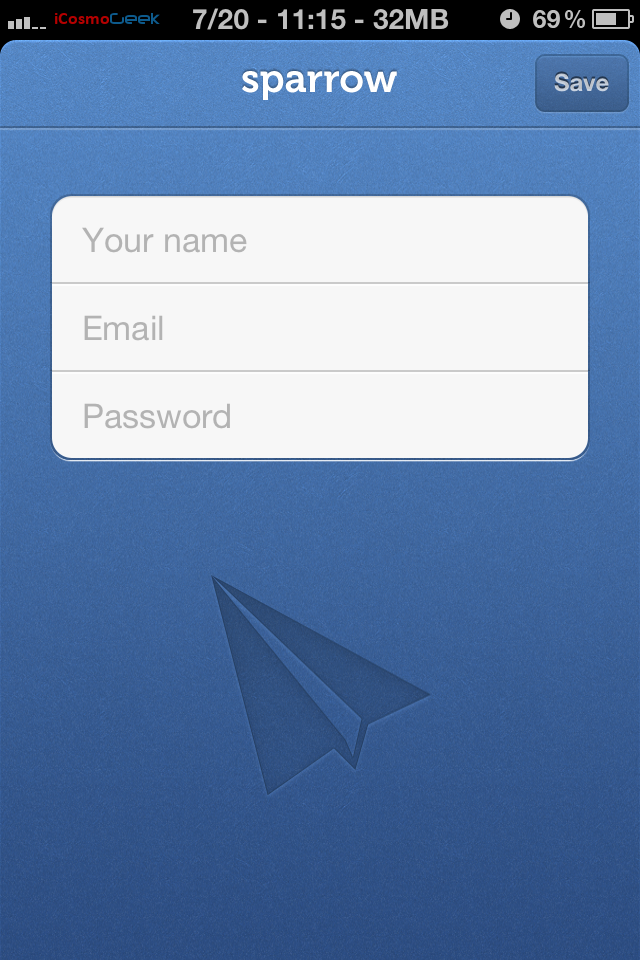

Popular third-party email genius client Sparrow has announced 20 minutes ago that it has been acquired by Google.

The company [tweeted](https://twitter.com/sparrow/status/226345906612604929) on its official twitter page about the acquisition. Dom Leca, CEO of Sparrow posted on the Sparrow blog that the company has been acquired by Google, and that they're joining the Gmail team to "accomplish a bigger vision."

> _We're excited to announce that Sparrow has been acquired by Google!_
> 
> _We care a lot about how people communicate, and we did our best to provide you with the most intuitive and pleasurable mailing experience._ _Now we're joining the Gmail team to accomplish a bigger vision — one that we think we can better achieve with Google._ _We’d like to extend a special thanks to all of our users who have supported us, advised us, given us priceless feedback and allowed us to build a better mail application. While we’ll be working on new things at Google, we will continue to make Sparrow available and provide support for our users._ _We had an amazing ride and can't thank you enough._ _Full speed ahead!_ _Dom Leca_ _CEO_ _Sparrow_

**Update:** The Verge is [reporting](http://www.theverge.com/2012/7/20/3172365/sources-google-sparrow-25-million-gmail-client) that the current Sparrow apps will receive no new features and this Paris based Sparrow with five person team was acquired for under $25 million.

The only good thing to happen now is to get the official Gmail app for iOS with goodness of Google and UX of Sparrow! Additionally, can we expect Android gets a boost with this acquisition?
