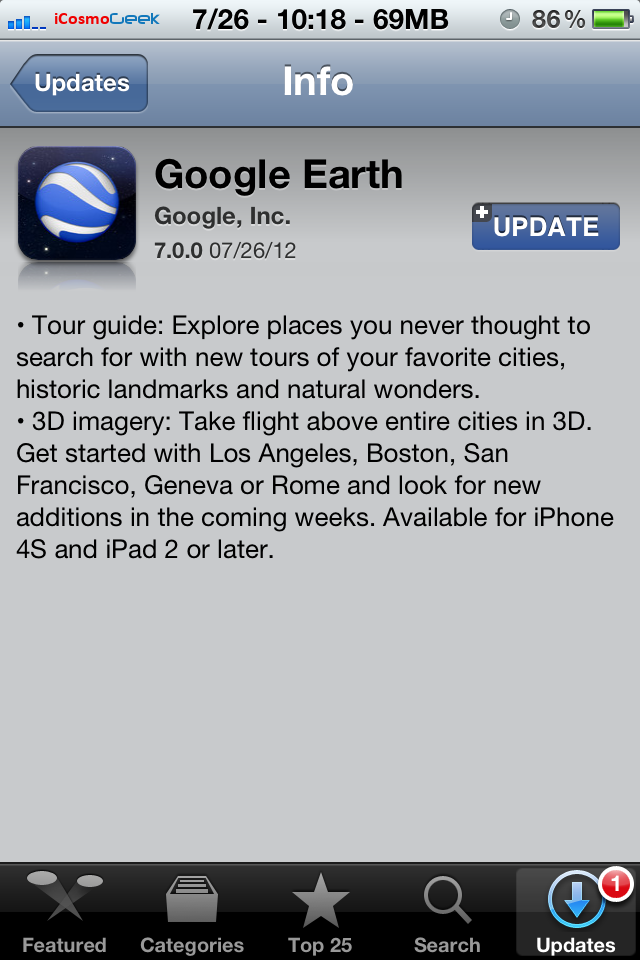

Today, Google announced the availability of 3D imagery for Google Earth on iOS devices. This much anticipated release is only available to iPhone 4S, iPad 2 and new iPad as rendering the polygons of Google’s 3D maps takes a lot of horsepower.

According to release notes of the app update (as shown in the screenshot above), Google Earth for iOS version 7.0 now offers 3D imager and tour guide:

> - _Tour guide: Explore places you never thought to search for with new tours of your favorite cities, historic landmarks and natural wonders._
> - _3D imagery: Take flight above entire cities in 3D. Get started with Los Angeles, Boston, San Francisco, Geneva or Rome and look for new additions in the coming weeks. Available for iPhone 4S and iPad 2 or later._

To recap, Google announced the next dimension in Maps back in June and also at [Google I/O 2012](http://icosmogeek.com/google-io-2012-day-1-2-highlights-android-4-1-nexus-7-tablet-google-glasses-and-more/) for Android devices. In an effort to beat Apple's own mapping solution which is going to release in iOS 6, Google updated its Google Earth app for iOS with this awesome 3D imagery feature. Interestingly, this feature is only available for some set of Android devices only.

According to the official [blog post](http://google-latlong.blogspot.com/2012/07/3d-imagery-now-available-on-ipad-and.html),

> _The growing list of 3D cities include Boulder, Boston, Charlotte, Lawrence (Kan.), Long Beach (Ca.), Los Angeles, Portland (Ore.), San Diego, Santa Cruz, Tampa, Tucson, and the San Francisco Bay Area (including the Peninsula and East Bay) as well as Rome, Italy. We’ll keep building and releasing 3D imagery for new locations as fast as we can and by the end of the year we aim to have coverage for metropolitan areas with a combined population of 300 million people._ 

Here are some of the screen shots of Los Angeles from Google Earth app in iPhone 4S:

\[gallery\]

Don't have a supporting device and want to experience this awesome feature? Here is an official video from Google:

<iframe src="http://www.youtube.com/embed/N6Douyfa7l8" frameborder="0" width="640" height="360"></iframe>
