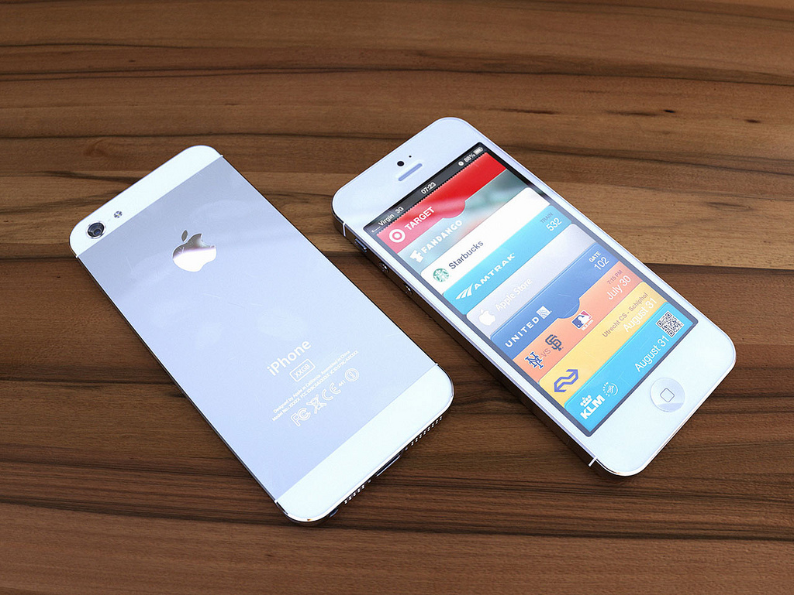
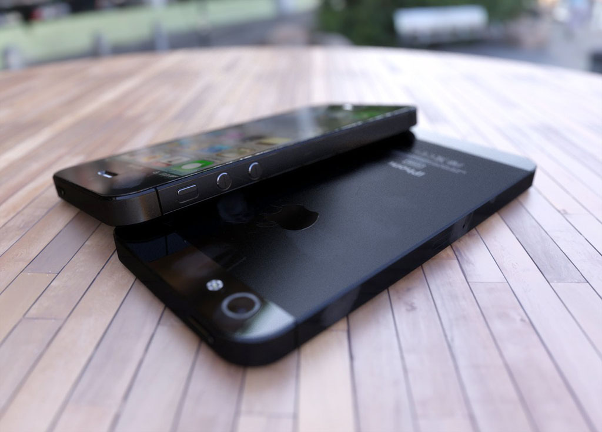

Majority of tech media sources confirm that Apple will hold an event on September 12 at which the company will likely unveil the new iPhone, probably called as iPhone 5.

iCosmoGeek usually don't exaggerate on the iPhone or iPad mini release rumors or concept devices that usually happen in Apple fan boys cosmos. But, this one seems to be legitimate and we covered this news item as this happens to be Apple's game changing device that could be a problem for Android. 

Before AllThingsD media, iMore was first to report that the company has scheduled a special event for Wednesday, September 12 with the release of new iPhone to follow 9 days later on Friday, September 21. According to the report, iMore also mentioned that there will be a **new iPad mini** as well as **iPod nano** along with **iPhone 5**.

With these two accurate sources, adding on the event confirmation dates, The Verge also confirmed on this release. According to iMore -

> _As for hardware, we're still hearing the iPad mini will be exactly like the 9.7-inch iPad, only scaled down to 7.x-inches. We originally heard Apple had a few iPhone 5 prototypes, including 3.5-inch and 4-inch versions, but recent reports and parts leaks make it look like the 4-inch, 16:9 screen version is what Apple's going with. We've also consistently heard all new iOS devices will have the new, smaller Dock connector iMore learned about back in February, which along with the nano-SIM and rumored in-cell display should leave lots of room for the LTE radio we learned about earlier in the year, and the bigger battery to go along with it._

Read More: [iMore](http://www.imore.com/apple-iphone-5-and-ipad-mini-event-planned-september-12-iphone-5-release-date-september-21), [AllThingsD](http://allthingsd.com/20120730/apple-stocks-up-on-components-for-fall-product-launch/)

Here is one more concept iPhone 5:

