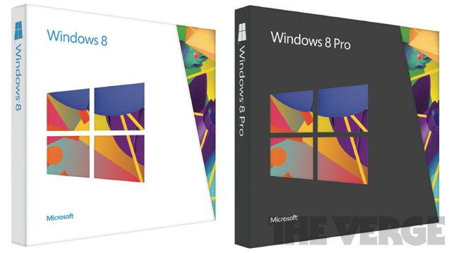

Just after Microsoft announced the final copy of its next generation operating system, Windows 8 is ready to ship, the build ISO is already [leaked online](https://twitter.com/k_avinash/status/231153134041460737) and available on several torrent sites, here is now the boxed copy is going to look like. This picture below will be how Microsoft is going to pack its Windows 8 to sell in retail stores from [October 26](http://icosmogeek.com/official-now-windows-8-to-go-sale-on-october-26/).

Microsoft has chosen to display its Metro Style ([stop calling it as Metro!](https://twitter.com/k_avinash/status/231248948306792449)) logo on the packaging. Are you excited to upgrade your PC?

\[[via](http://www.theverge.com/2012/8/6/3224149/windows-8-packaging-retail-box)\]
