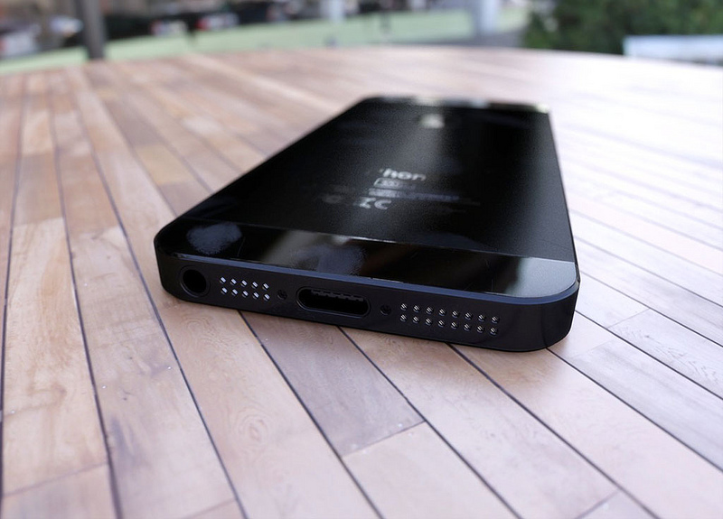

The next generation iPhone (_to be called as 'New iPhone' or 'iPhone 5' ?_) which is going to arrive next month somewhere around [September 12](http://icosmogeek.com/tech-media-sources-confirm-iphone-5-for-september-12/) is a real game changer for Apple. If you are one of those Apple fan boys who eagerly wait and purchase new devices by standing in those long lines or even if you are not an Apple fan but waiting to purchase a killer smartphone, you should really wait for this biggie! And if you already own iPhone 4S which is almost one year old device, now is the time to sell it. The question everyone asks, where to sell your iPhone 4S for good deal?

\[[Credit](http://www.flickr.com/photos/nepaltibet2005/7176607053/sizes/c/in/photostream/)\]

Folks at [Gizmodo](http://gizmodo.com/5934778/where-to-sell-your-iphone-4s-for-the-most-money) have compiled a good list where you can sell your iPhone 4S for best deal. Follow the link for detailed explanation.

> 1. _**eBay for $350 to $400**_
> 2. _**Amazon for $120 to $415**_
> 3. _**RadioShack for $73 to $250**_
> 4. _**Craigslist for $200 or more**_
> 5. _**Gazelle, InstantSale, Buy My Tronics, Next Worth - all these for around $90 to $365**_

Would you consider upgrading your device for the next upcoming iPhone? If you plan to sell, where and how would you do? Let us know in the comments section below.
