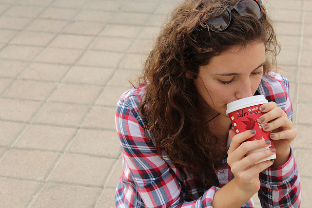
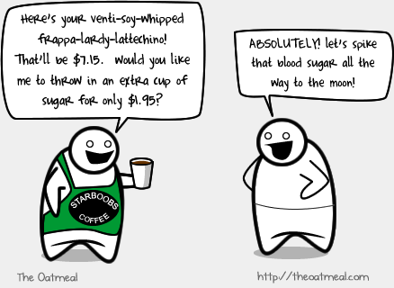
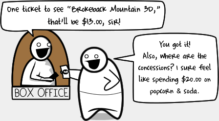
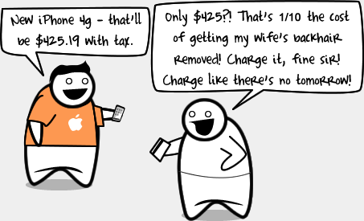
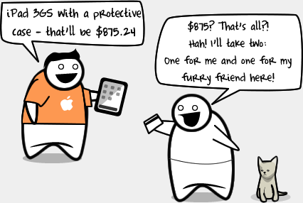
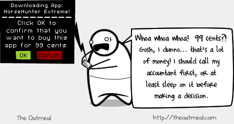

We say this again and again - I am sure many of you who download apps from Apple App Store or Google Play or any other platform must have thought about it. Why should I pay 99 cents for this app? Is it really worth? But at the same time, when you visit your favorite coffee shop (Starbucks?) for a $7.15 coffee, you won't think much about it. Why?

Designer and software developer, Josh Lehman did a fantastic analysis on why people won't pay $0.99 for apps, but will spend $7.15 for coffee.

\[[Credit](http://www.flickr.com/photos/71764621@N03/6501164973/sizes/z/in/photostream/)\]

The post author asks everyone to stop using the analysis that many of us (and developers) continue to worry about their apps being not sold out even for small price tags. The main argument in this [post](http://www.joshlehman.com/thoughts/stop-using-the-cup-of-coffee-vs-0-99-cent-app-analogy/) titled - "Stop Using The Cup of Coffee vs. $0.99 App Analogy", Josh presents is that Starbucks is a known thing with a trustworthy experience to its customers.

> _I know I’ll like my cup of coffee. It will fully meet my expectations...It’s an experience I can fully trust will be pretty much the same each time. There’s no gamble here...I know what I’m getting for $4 and I’m getting that same experience every time I hit the drive thru._

Now in contrast with an app, your$0.99 app purchase will be completely different, each and every time you purchase it. The $0.99 you spend in no way guarantees you the app or the experience you crave.

> _I already have 30 games on my phone, some of them very good. Do I need another one? I don’t play the 30 I have. The experience I’m going to get from adding one more game is not trustable. I’m assured of nothing. Last week I bought a game for 99 cents and it was terrible. I played it once, for 15 seconds. I could be shoving $1 straight down the toilet again for all I know._ 

Later in the post, he mentions that there is no free cup of coffee at Starbucks. People would most likely stop paying for that coffee fairly quickly and pick up the free coffee habit. So, instead of complaining about apps being not sold or about cheapness of average human, developers need to concentrate on the reality. Make great apps with unique experience which are useful to daily life.

> _**Just do what Starbucks does:**_ _Build an app experience that’s unique and doesn’t feel “easily replicated”_ _Provide something the user sees as valuable to their daily life_ _Package it such that it shows off its craftsmanship_ _Find creative ways to profit off of a “free” version (Starbucks doesn’t do this…. yet)_ _Quit complaining about money wasted on cups of coffee_

Surely this will be a win-win situation for developers who are making valuable apps. What are you thoughts on this app analogy?

_**Bonus**: Here is a comic on how a common person feel about buying apps -_ 

\[[Comic Credit](http://theoatmeal.com/blog/apps)\]
