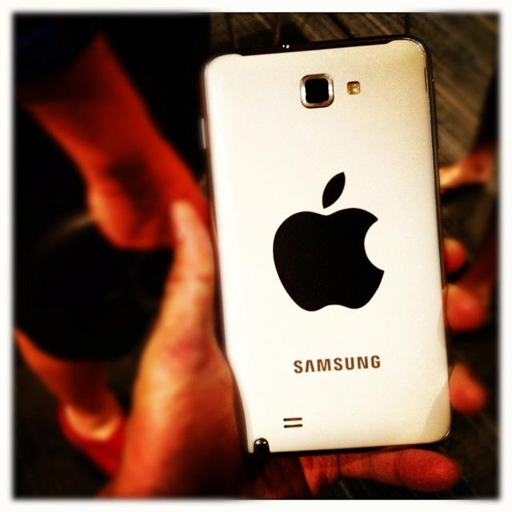
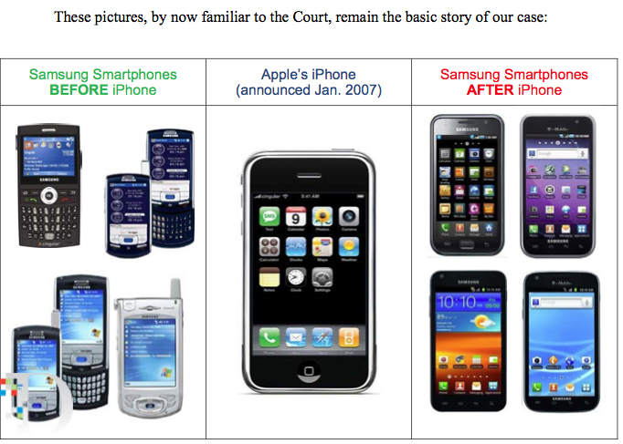

That was fast! With the jury just [completed](http://www.nytimes.com/2012/08/25/technology/jury-reaches-decision-in-apple-samsung-patent-trial.html) last Friday with a decisive victory in a lawsuit against Samsung, Apple wasted no time in [filing a case](http://assets.sbnation.com/assets/1317266/show_temp.pdf) identifying which Samsung products to have banned in the U.S. Most of these devices that Apple wants to kill in patent case are no longer available in the US.

The eight Samsung devices that Apple wants to ban are:

> _**1\. Galaxy S 4G**_ _**2\. Galaxy S2 AT&T**_ _**3\. Galaxy S2 Skyrocket**_ _**4\. Galaxy S2 T-Mobile**_ _**5\. Galaxy S2 Epic 4G**_ _**6\. Galaxy S Showcase**_ _**7\. Droid Charge**_ _**8\. Galaxy Prevail**_

Separately, Bloomberg [reports](http://www.bloomberg.com/news/2012-08-27/apple-seeks-sales-ban-on-samsung-s-cellular-galaxy-tab-computer.html) that Apple is seeking a ban on the cellular version of **Samsung’s Galaxy Tab 10.1** tablet. Notably, this is the tablet that the U.S.-based jury believed did not infringe Apple’s patents.

Finally, this is the basic story of the Apple vs Samsung patent case with image credit to [AllThingsD](https://allthingsd.com/20120724/apple-to-samsung-you-give-us-2-5-billion-and-well-give-you-a-half-cent-a-unit-royalty/):

