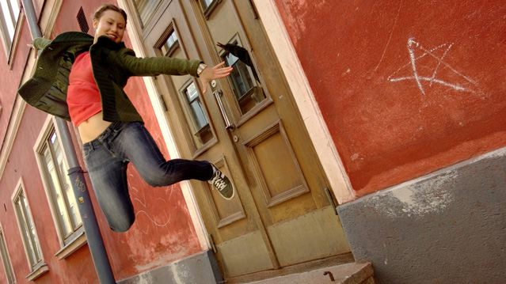
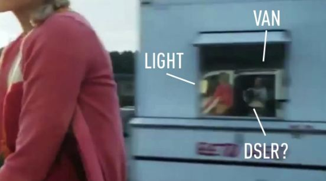
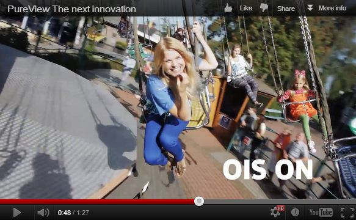

Earlier today, Nokia announced Lumia 920, which comes with PureView, the same technology which received a decent response for [41 MP Nokia 808  device](http://icosmogeek.com/why-megapixels-dont-matter-and-nokias-41mp-phone-is-just-a-hype/). During its press event, Nokia gave a look at the new PureView’s main feature: optical image stabilization (OIS). The idea behind this new feature is that it stabilizes the video you’re recording, giving you a more professional look instead of the amateur shaky-cam effect. To demonstrate this technology, Nokia played an impressive ad which show cases a side by side comparison of the video shot without OIS and with OIS. Obviously, the video shot without OIS doesn’t look very good, whereas the video shot with OIS activated looks excellent. Strangely, Nokia faked this PureView ad!

Its been revealed that the ad was not shot using the Lumia 920 and Nokia admitted in an official blog post.

According to Nokia, initial PureView model was focused on the problem of digital zoom and perfect details. Phase two of development focuses on low light performance, and adds more practical features that will allow more camera phone users to take better pictures. Watch the original ad below to feel the technology:

 

<iframe src="http://www.youtube.com/embed/cimDfEIEiu0" frameborder="0" width="560" height="315"></iframe>

Here is how Nokia faked its ad.

If you go to 0.27 part of the video, we see the reflection of a white van keeping pace with the girl in one of the trailer’s windows. Here is the screenshot below to see for yourself:

 

Also, if you go to 0:48 of the video, you can clearly see the DSLR shadow which is hooked up to the swing.

[The Verge](http://www.theverge.com/2012/9/5/3294545/nokias-pureview-ads-are-fraudulent) discovered first that this ad was all fake and was not shot using the Lumia 920. It says -

> _As you can see in the video and photo above, there's a curious reflection in the window of the trailer in the background. It's not a young man riding his bicycle alongside the cheerful model, but instead a big white van with a lighting rig and a cameraman standing in the doorway — with what appears to be a large camera rig. Whatever he's holding, we can reasonably agree it's not a Lumia 920._

Later, Nokia admitted that the video was not shot using the Lumia 920 in its blog by posting a note at the end of the [post](http://conversations.nokia.com/2012/09/05/taking-pureview-to-the-next-level/):

> _The Lumia 920 pictures in this post were taken using prototype hardware and software, and then reduced dramatically in size. In addition, the OIS video, above, was not shot using the Lumia 920._ 

The point is average Jo would think that it was shot on the Lumia. Whatever it may be, and despite the mistake happened, Nokia's PureView technology may does what the company is claiming so far, may be up to some extent if not all shown in the deceptive demonstrations.  What's your take on this whole thing?

**Bonus:** Animated gif of the busted clip!

**Update 2:** Nokia has come around and [apologized formally](http://conversations.nokia.com/2012/09/06/an-apology-is-due/) for the above hand trick saying it should have put a disclaimer in the video. In addition, they released a new video showing the magic of PureView with an actual Lumia 920 device. The difference is clear. Happy now?
