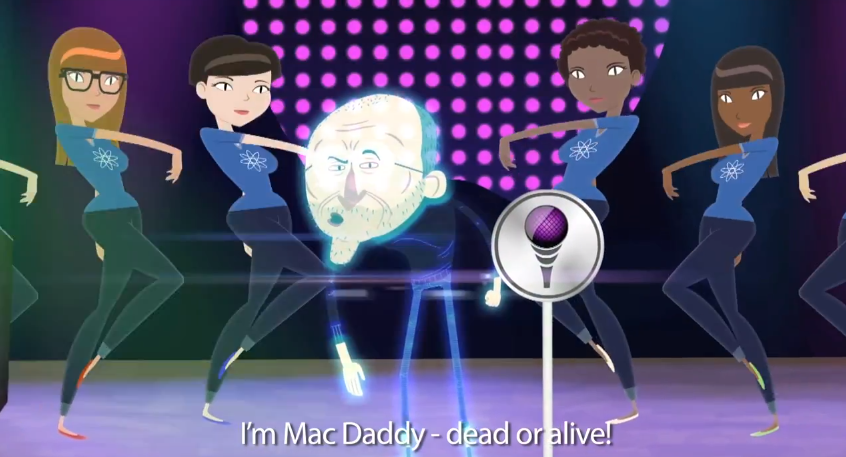

Sometimes I wonder how much time people got for this so called creativity (or sh\*t)? Check out this hilarious animated video in which Steve Jobs restore to life to take over iPhone 5 keynote.

This song which was written by Andy Ochiltree and directed by Aaron Simpson is going viral on YouTube. The best part is when Steve shouts "Whatcha gonna do - buy the Galaxy? (broken sound)" at 2:44 segment.

Enjoy the video after glancing at the lyrics!

> COOK: Before I introduce the iFhone 5, I'd just like to say . . . COOK: Steve Jobs built this company. COOK: He's the reason we're here today COOK: and we see the effects of his legacy in everything we do. COOK: But not anymore! (laughs) Now begins the era of COOK. COOK: Apple's mine, you hear me? ALL MINE! COOK: Huh?! Steve?! How the hell... JOBS: WHAT? You thought if Tupac could come back from the dead STEVE JOBS couldn't figure it out?! PLEASE.
> 
> I'm back, bitches! The man with the plan! Mac Daddy, even as a hologram {He's back} It's been awhile, but it's worth the wait Cause I got the OS that makes ya salivate
> 
> Y'all been waitin', debatin' and speculatin' no patience You peepin' mock-ups and chock-ups and mentally masterbatin' I been in heaven, (angelic choir sound "Ahhhh") Workin' on the specs Choosin' the hotness I'm gonna drop on ya next
> 
> My designs so tasty they edible Even Jesus Christ like JESUS: Jesus! You're incredible!
> 
> COOK: But Steve, you don't handle design.
> 
> COOK: That's Jonathan Ive. It's a bald-faced lie!
> 
> No one likes you - so shut up, Cook! Or I'll beat yo skinny ass with my new MacBook I'm sick of your whinin' and stichin' always complainin' and bitchin' Someone get this hack Cook out of my kitchen!
> 
> Now get ready for some monumental cash flows Cause Cinco gonna blow your mind, fo sho!
> 
> CHORUS (x2): iFhone 5! I'm Mac Daddy - dead or alive! So just buy, and don't ask why You know you're gonna get an - iFhone 5!
> 
> 3Gizzle! That sh\*t was a huge success Then I sold a butt-load of the 3GizzleS Number four, 'nother score, jaws hittin' the floor, Y'all acted like you never seen a phone before
> 
> I was rich bitch, didn't give a f\*ck Swan divin' into gold like Scrooge Mcduck San Francisco ridin' all up on my jock Got more California Love than my boy Tupac {Changes} But then the word hit the street - My hardware was obsolete
> 
> CHORUS: iFhone 5! I'm Mac Daddy - dead or alive! So just buy, and don't ask why You know you're gonna get an - iFhone 5!
> 
> And now, the real star of the show The future of talk -- iFhone cincooooo!
> 
> FANBOY: "Bullsh\*\*! It's the same phone as before! JOBS: Not true! It's got a new power cord.
> 
> We switched the dock up arbitrarily, So I hope you like buyin' new accessories. See the new design- yeah it's out-of-control We went nuts and switched it up from black to charcoal {Say what?}
> 
> Plus the screen's two millimeters taller That's gotta be worth at least four hundred dollars
> 
> FANBOY: "You did all the cool stuff with iFhone 4!"
> 
> But ya still gonna buy it for the app store Whatcha gonna do - buy the Galaxy? You'll still line up for iFhone eighty-three!
> 
> Cause Apple got the sh\*t y'all crave. {Y'all crave} I teabag Bill Gates from beyond the grave!
> 
> COOK: Hallelujah Steve! You've shown me the light! COOK: It's your Apple, and I'm just taking a bite
> 
> It's cool, Cook -- I got a turtleneck for you Now let's tell these people what they need to do
> 
> CHORUS (x2): iFhone 5! I'm Mac Daddy - dead or alive! So just buy, and don't ask why You know you're gonna get an - iFhone 5! -----

 

<iframe src="http://www.youtube.com/embed/GXr1kmuqGcU" frameborder="0" width="560" height="315"></iframe>
