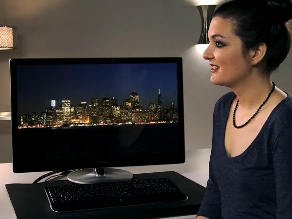

After Samsung unvieled their prestigious Series 9 display monitors at CES press event 2012, there was a good reponse from tech enthusiasts around the world who got a chance to hands-on these 27-inch, 2560 x 1440 LED monitors with billion color display.

It uses a Plane to Line Switching (PLS) panel which is similar to In-Plane Switching (IPS) technology, but according to Samsung, they provide better viewing angles and image quality.

 

If you consider the technical specs where geeks are excited about, all these monitors include Mobile High definition link (MHL) which is an interface found in some newer smartphones, such as the Samsung Galaxy S II, III, Nexus. Also, MHL does not use a special port and it can be used along with your micro-USB and HDMI.

Other notable specs apart from 27" wide with 2560 x 1440 resolution include, 16:9 aspect ratio, built-in speakers. The following demonstration videos shows that these monitors are already calibrated by experts with a manual option of calibration, and with consistent colors all over the panel. To complete the experience, these monitors features a stunning design, with a hidden crystal clear glass panel display, a height adjustable stand, and a premium solid metal frame that deliver a richer multimedia experience.

 

 

**Movie Fanatics Video:**

**Photographers Video:**

**Tech Geeks Video:**

One notable point might be the higher price of over $1199 which are expensive than Apple's Thunderbolt which has same screen size and resolution pricing around $999. More details from the official Samsung website over [here](http://www.samsung.com/us/computer/monitors/LS27B970DS/ZA). Would you consider purchasing these monitors?
