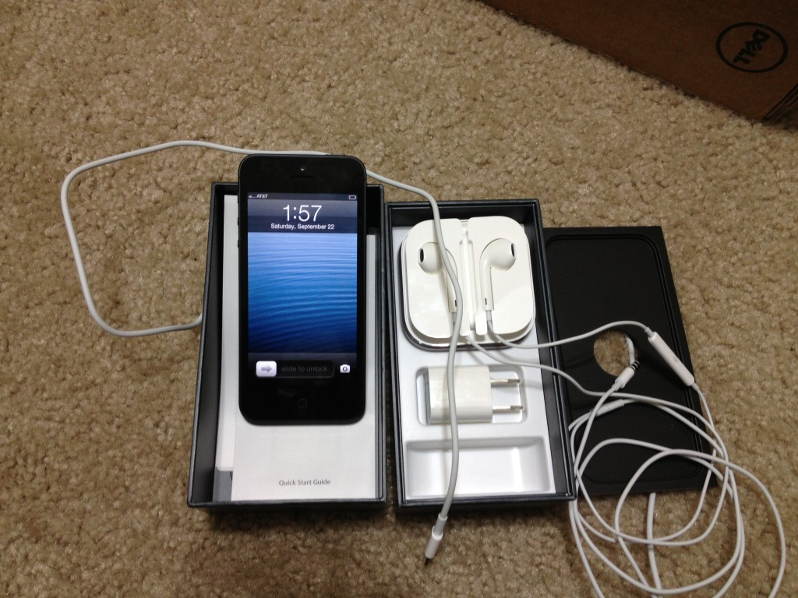
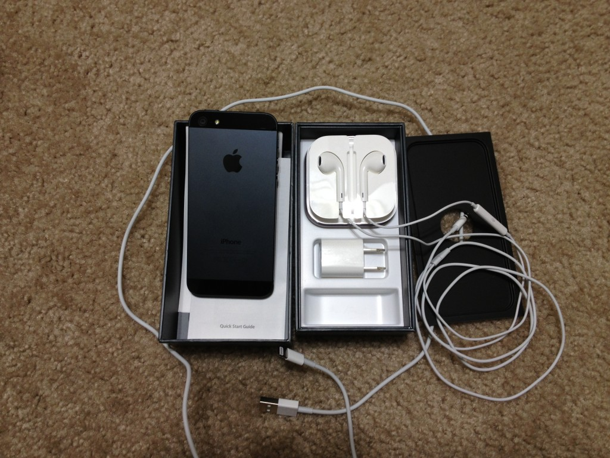
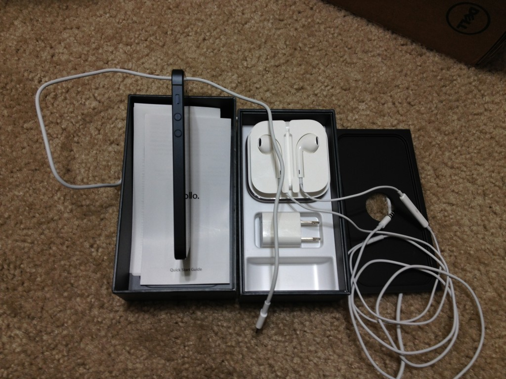
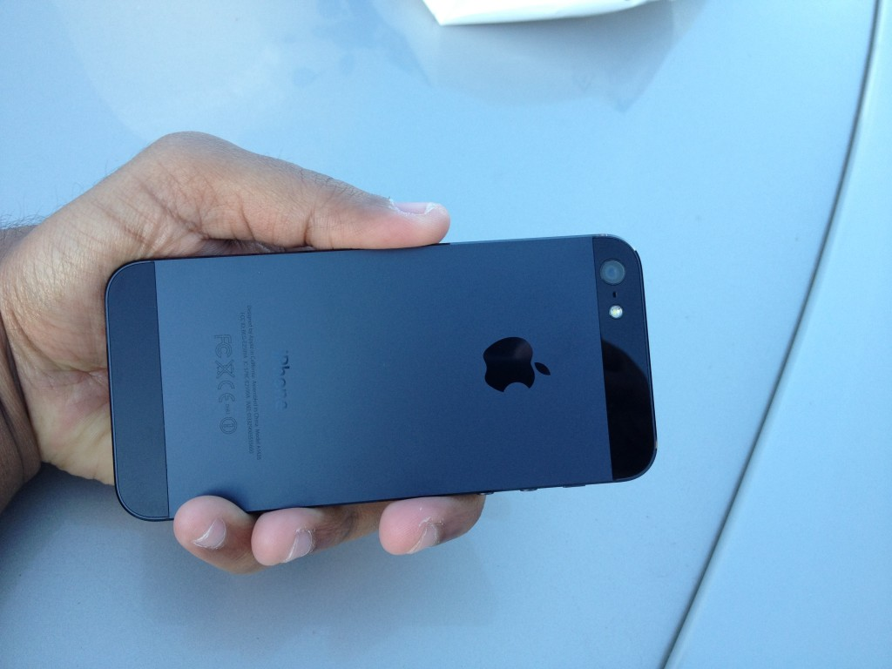
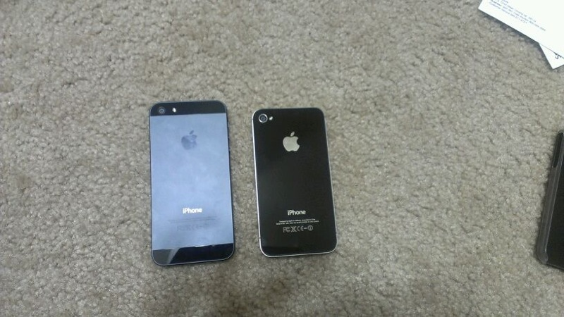
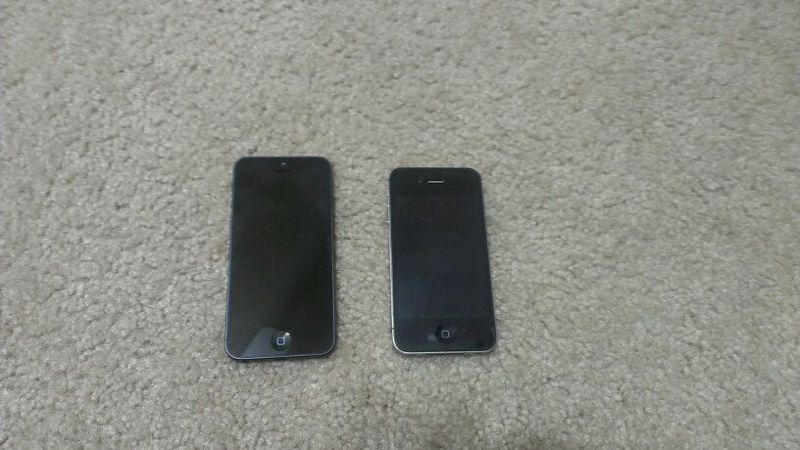

With the Apple iPhone 5 unleashed on Friday, I got a chance to get a closer look of this amazingly beautiful device. The first noticeable change to the iPhone 5 when compared to [iPhone 4S](http://icosmogeek.com/iphone-4s-unboxing-pictures/) is its light weight. It's not the same phone in slightly different packaging. And, most importantly, it's still very recognizably the most popular smartphone in the world. More technical specifications at the official website over [here](http://www.apple.com/iphone/specs.html).

Here are some of the unboxing and comparison pictures of iPhone 5 vs iPhone 4S at the end with iPhone 5 on the left.

 

 

 

 

