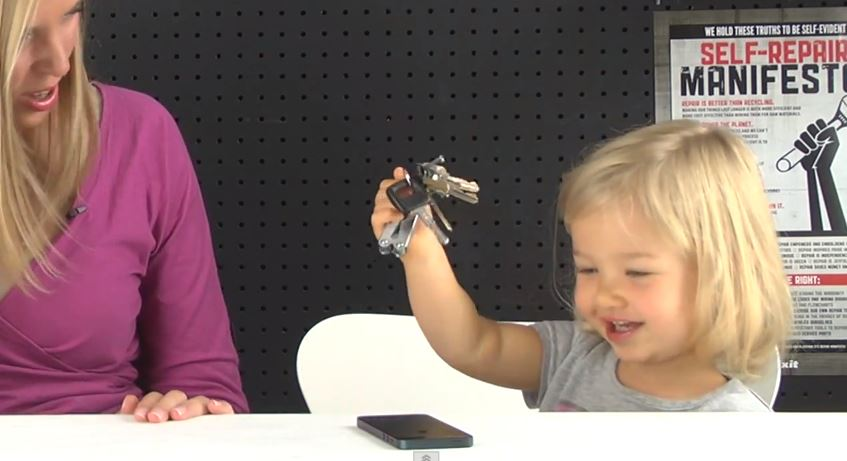

I am using a crystal case for my iPhone 4S. But, do you actually require a case for your amazing small device? Well, there is a small excuse for this fragile black glass on the back of iPhone 4 or iPhone 4S devices. But, there is no excuse anymore for buying a case for iPhone 5 because it is made by aluminium. She can't break herself. There is no point of screen scratches for this amazingly beautiful device.

I know you won't believe me! But following videos from YouTube reveal some interesting surprising results.

<iframe src="http://www.youtube.com/embed/k2BxL0nRDlY" frameborder="0" width="560" height="315"></iframe>

 

And finally, folks at [iFixit](http://www.ifixit.com/) have done a good job with their unique test in the following video. This one has somewhat different results compared to above videos.

<iframe src="http://www.youtube.com/embed/OSFKVq36Hgc" frameborder="0" width="560" height="315"></iframe>

Before running these tests on your device (I know you won't!), I would advice you to  not treat this gorgeous device like a piece of trash and if you do, obviously it'll get scratched, dented or something other. Decide yourself! Let us know your thoughts in the comment section below.
