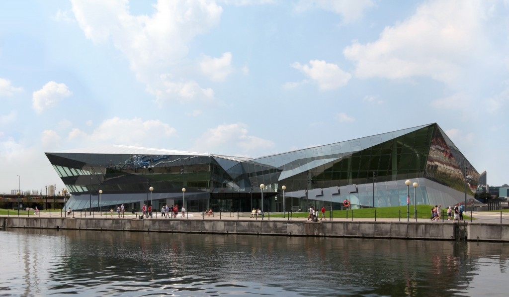

Siemens has opened its first center for sustainable urban development in London, UK that claims to host the largest exhibition and conference center in the world dedicated to promoting smart city technologies in the project name 'The Crystal'.

The glass paneled building cost around $50 million is to help cities of the future embrace new technologies and tackle growing populations and resource scarcity.

**What is Crystal?**

> _"The Crystal is a sustainable cities initiative by Siemens that explores how we can create a better future for our cities. It is home to the world's largest exhibition focused on urban sustainability._
> 
> _As a world-class centre for dialogue, discovery and learning, it reveals the challenges that cities face, and the ways we can reduce their environmental impact using sustainable technologies, many available today."_

This project is for everyone and brings together mayors, city decision-makers, politiciaons, urban planners, architects and infrastructure experts as well as the local community, international visitors and educational groups, from school children to post-graduate students. The Crystal is one of the world’s greenest buildings, with exemplary BREEAM and LEED accreditation.

The Crystal which is located on the waterfront at the western end of the Royal Victoria Docks in East London is an "all electric" building, which operates free from fossil fuels, thanks to a large number of solar panels on the roof. Battery storage will ensure that any excess energy generated doesn't go to waste. This centre is the largest of three planned by the company, with two smaller facilities planned for Shanghai and Washington. Following its two inaugural conferences, it will open to the public on this September 29.

> _“Cities worldwide are making investments to improve their water supplies, power grids, transportation systems and building infrastructure. In this growth market, the Crystal will help us intensify dialogue with our customers,” says Roland Busch, chief executive of the company’s Infrastructure and Cities sector._

According to Siemens, cities account for around 80% of global economic output, two-thirds of global energy consumption, and 70% of worldwide greenhouse gas emissions.

Further information and videos are available at official [website](http://www.thecrystal.org) and YouTube [channel](http://www.youtube.com/user/Siemens/custom).
