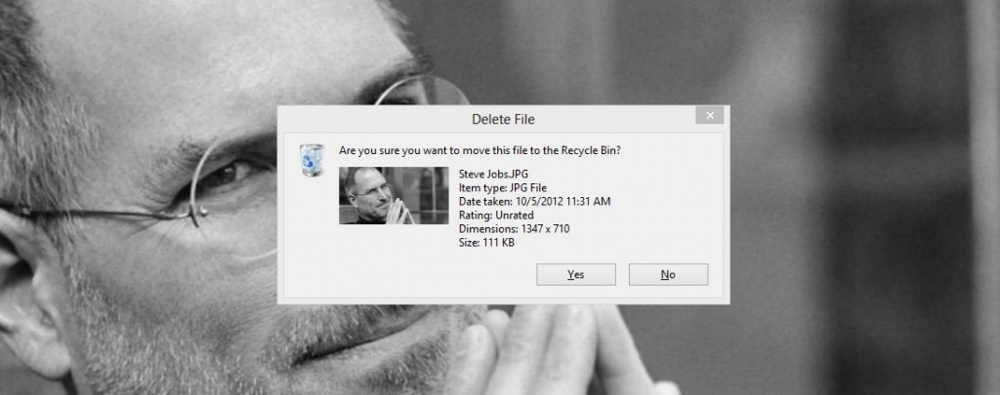
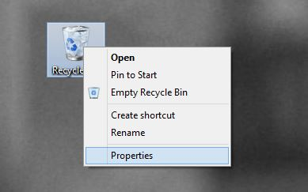
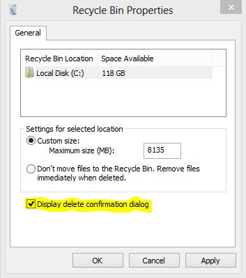

If you have recently switched to Windows 8 ([official release date](http://icosmogeek.com/official-now-windows-8-to-go-sale-on-october-26/) to consumers is October 26) or going to migrate in next  few months, you'll notice a significant change when  you delete a folder/file. Microsoft disabled the delete confirmation box and whenever you delete a file and they'll automatically go to Recycle Bin without any confirmation.

And here are simple steps to enable delete confirmation dialog in Windows 8.

 

**Steps:**

1\. Right click on the Recycle bin icon from your desktop and select Properties

2\. In the properties window, check the option "Display delete confirmation dialog" and click "OK" to apply changes

Now, next time when you try and delete some folder or file, you will be asked if you really want to delete them and move to Recycle Bin. Note that even if you select or not select the above mentioned option, deleted files will not permanently delete, but will move to Recycle Bin in either of the cases.

If you want to to delete something without sending it to Recycle bin you can always use the Shift + Delete keyboard combination.
