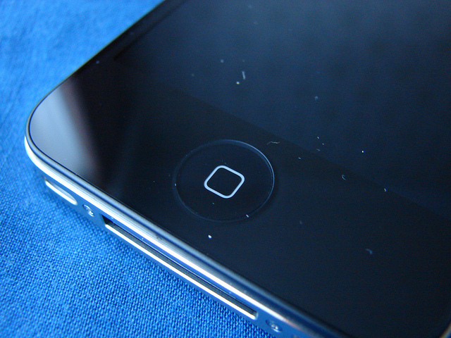

The iPhone is a great device. It is a always a winner due to its build quality and reliability. But sometimes, the Home button on the iPhone can just behave a little funky, a little laggy, a bit unresponsive. I have experienced this issue on my iPhone 4S couple of times and I am sure it is an issue in other models as well.

Most of the times, these issues are caused by software, unless you've dropped your iPhone in water! And a simple Internet research confirmed that a re-calibration is usually all that’s needed to fix most issues with the iPhone’s Home button. Follow these simple steps below which will hopefully leave you with a more responsive, happy home button.

 \[[Credit](http://www.flickr.com/photos/yum9me/4943863697/sizes/z/in/photostream/)\]

**Steps:**

1. Open a **stock app** (like Weather, Stocks or any app that came part of your iPhone)
2. While the app is opened, press and hold your **power** button (located at the top of the device) until “slide to power off” appears and release
3. Press and hold your **Home** button until the “slide to power off” goes away, and the app force quits back to home screen.

Your iPhone’s Home button should now be more responsive, as it has been recalibrated. I realize this is a known trick that’s been floating around for some time, but I just used it myself personally for the first time and I got good results. What about you?
