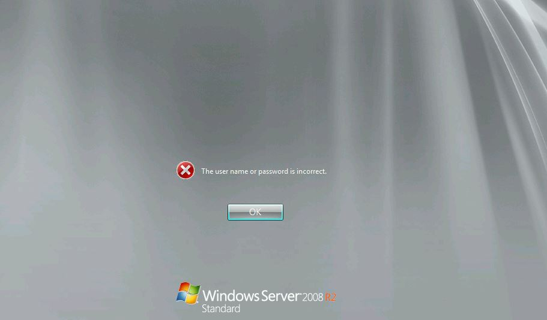
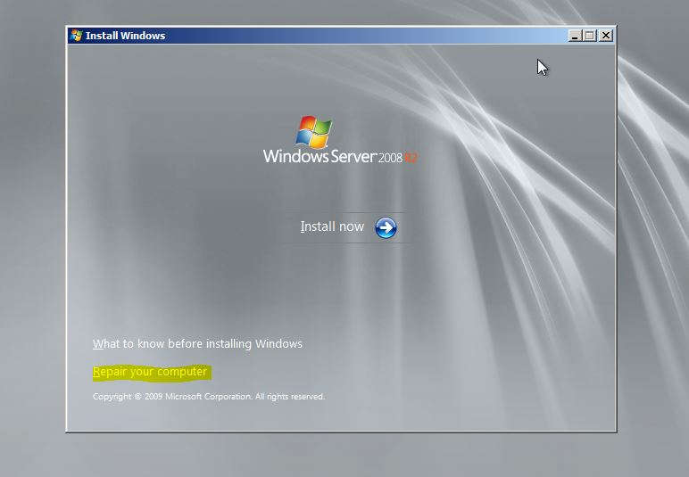
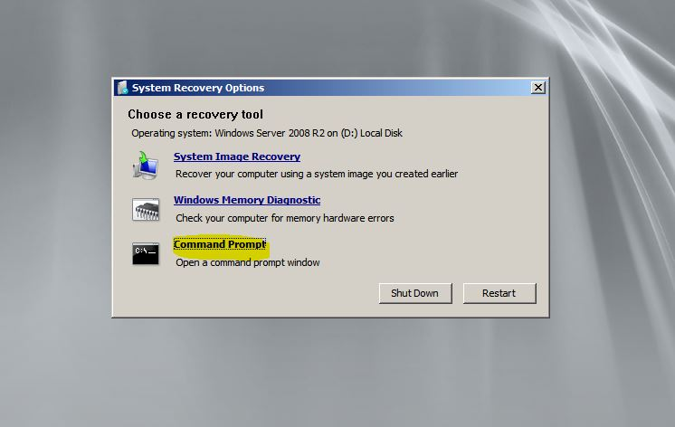
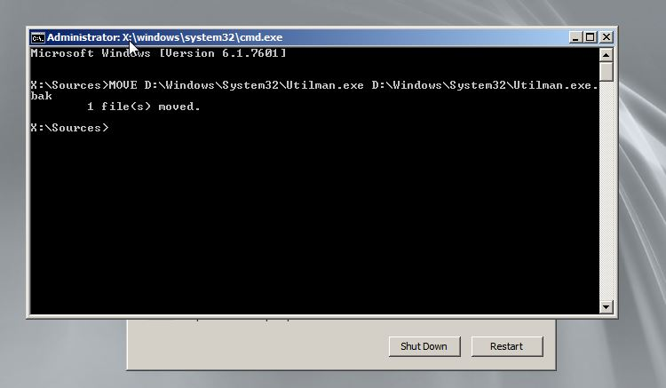
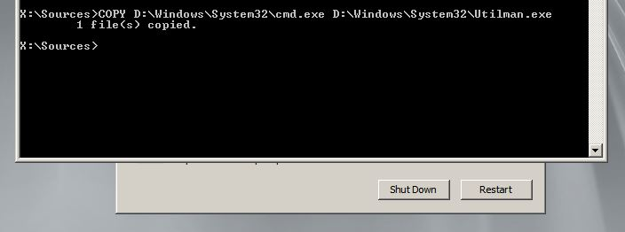
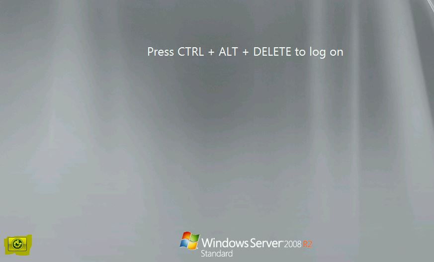
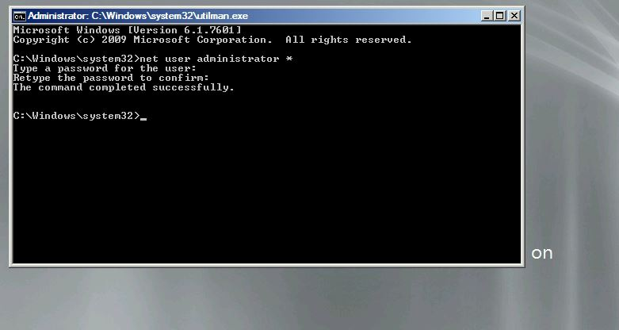

One of my friends recently contacted me to help reset domain admin password on Windows Server 2008 R2 domain controller that I helped him set up a year back. There are many tools in the market which help resetting administrator password. In fact, most of them help in resetting local administrator password, but not domain administrator password.

Here is an easy way to reset your Domain Administrator password. All you need is a copy of the Windows Server 2008 R2 installation disk and one simple command line trick.

**Steps:**

1\. Boot up the server using Windows Server 2008 R2 installation disk and select 'Repair your computer' as shown below

2\. Proceed to the next step and select 'Command Prompt' option

3\. In the command prompt, backup utilman.exe file using following command. You may have to change your drive letter to Windows directory accordingly

**MOVE C:\\Windows\\System32\\Utilman.exe C:\\Windows\\System32\\Utilman.exe.bak**

4\. Make a copy of cmd.exe and rename it to Utilman.exe using following command

**COPY D:\\Windows\\System32\\cmd.exe D:\\Windows\\System32\\Utilman.exe**

5. Restart the server normally and press the key with the Windows logo and the “U” key at the same time at the login screen. This will bring up the command line window. Alternatively, you can click the Ease of access icon as shown below

6\. A command prompt will open up and type the following command to change the password:

**net user administrator \***

7\. That's it! Exit out the command prompt and try logging again with new changed password. Finally, reboot the server again to the installation disk and undo the changes. That is, delete Utilman.exe and then rename Utilman.exe.bak back to plain old Utilman.exe using simple **del** and **ren** commands.

I have tried above mentioned steps on a Windows Server 2008 R2 and I am sure these steps will also work on Windows Server 2008. It goes without saying that you should make a backup of your system before doing any of this, and more importantly, I bear absolutely no responsibility if you mess up your system. Remember, we are not trying to access a box we have no business accessing in the first place – take the hint or risk going to jail or ready to get laid off!
