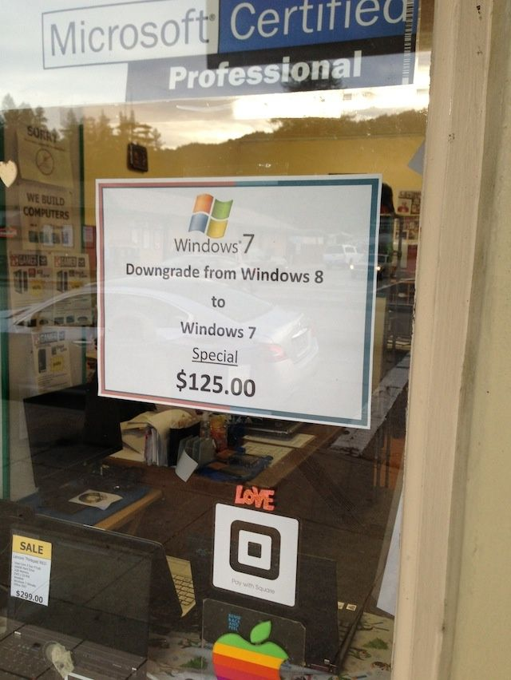

Love it or hate it, you will get a new laptop pre-installed with Windows 8. The new UI is pretty gorgeous, but you're confused! Something weird, you can't find your own files easily as they have for the past 10 years. It's just an unpleasant dream and you just want your old Windows back?

Well, don't worry! There are Microsoft Certified Professionals who can help you with downgrade option to Windows 7. And for that, they'll charge you $125 only! This can't be a good sign for the software giant.

\[[Source](https://twitter.com/Jury/status/293879721652015104)\]

P.S. I agree no OS is perfect. I am personally using Windows 8 since the product was released into the market. I actually like it, not a fan at all of the tiles so I'm on the desktop portion of Windows 8 for 99% of the time. Overall the OS seems leaner and quicker which is saying a lot since Windows 7 was pretty decent. Meanwhile, checkout this cute Windows 8 demo video -

<iframe src="http://www.youtube.com/embed/G3xnq8d_Tdw" height="315" width="560" allowfullscreen frameborder="0"></iframe>
