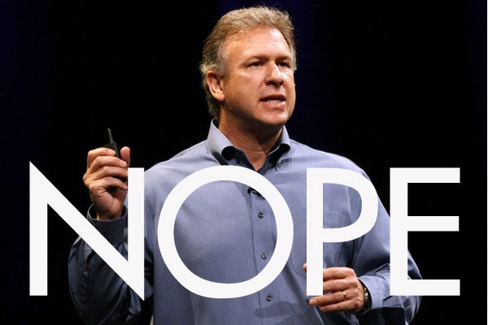

With less than 24 hours before the launch of the next flagship Android phone ([_read Galaxy S IV_](https://www.facebook.com/photo.php?fbid=561948720495576&set=a.144053918951727.22409.132336730123446&type=1&theater)) , Apple executive Phil Schiller made some negative comments about Google's open source mobile OS; besides bring up the "F" word - fragmentation.

 

According to Phil,

> "When you take an Android device out of the box, you have to sign up to nine accounts with different vendors to get the experience iOS comes with," he said. "They don't work seamlessly together."
> 
> .....
> 
> "With their own data, only 16 percent of Android users are on year-old version of the operating system. Over 50 percent are still on software that is two years old. A really big difference."

\[[READ MORE](http://online.wsj.com/article/SB10001424127887324077704578358760931327672.html)\]
