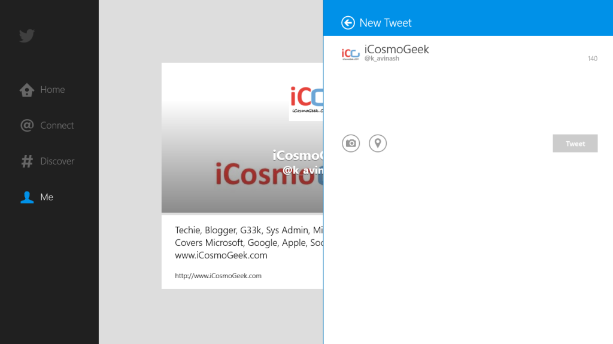

Official twitter app for Windows 8 is now available for download. It is available in the Windows Store now in 22 languages which brings the Home / Connect / Discover / Me tabs found in other official apps, plus support for Windows new UI features like snap view, the search charm and Live Tiles.

You can download the app from this [link](http://apps.microsoft.com/windows/app/twitter/8289549f-9bae-4d44-9a5c-63d9c3a79f35) and read more about in official Twitter blog post over [here](http://blog.twitter.com/2013/03/welcome-twitter-for-windows-8.html).

 

