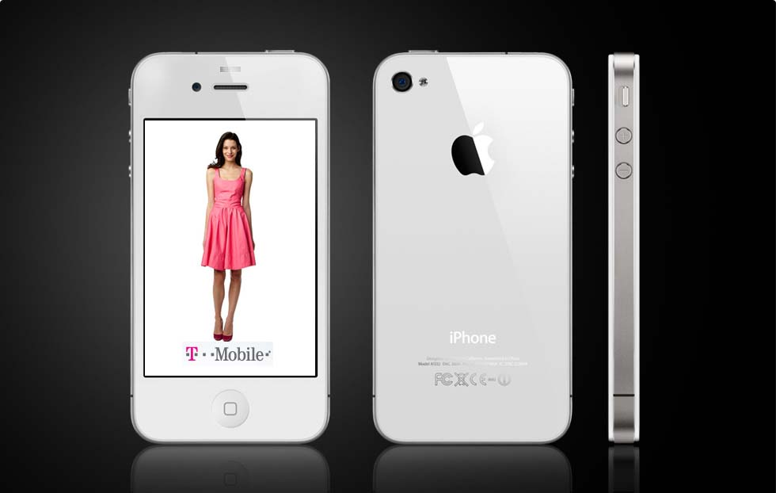

As expected, T-Mobile finally lands the iPhone. That's six years after Apple announced first game changing device. The company will start offering iPhone with LTE support starting from April 12, 2013. Now that iPhone (especially iPhone 5) is available on all major US carriers, which carrier offers the best deal? After careful breakdown, looks like, I'm going with T-Mobile down the lane after my contract ends with AT&T. T-Mobile is the clear winner on price — with a 16GB iPhone 5 and two years of service costing nearly $600 less than AT&T and Verizon and nearly $1000 less than Sprint.

Check out the comparison below.

Unlike AT&T, Verizon and Sprint – or most of the world’s carriers for that matter – T-Mobile will sell Apple’s device contract-free, tapping its previously mulled monthly installments in another uncharacteristic industry practice.

> _“We’re canceling our membership to the Wireless Carrier Club,” CEO John Legere made jokes at the presser._

Specifically, per T-Mobile’s [press release](http://newsroom.t-mobile.com/articles/t-mobile-unleashes-iphone-5), you’ll be paying $99.99 upfront to get an entry-level 16GB iPhone 5, without a two-year service contract. The rest of the device’s unsubsidized price will be recovered through installment plans requiring you to drop an additional $20 over the next 24 months.

[Mashable](http://mashable.com/2013/03/26/iphone-5-rate-plans-compared/) did a quick comparison for an iPhone 5 on Sprint, AT&T, Verizon and T-Mobile.

|  |  Sprint Simply Everything |  AT&T Mobile Share Plan |  Verizon Share Everything |  T-Mobile Simple Choice Unlimited |
| --- | --- | --- | --- | --- |
| **iPhone 5 price (16GB)** | $199 | $199 | $199 | $99 down, $20 a month for 24 months |
| **Monthly Bill** | $109.99 | $110 | $110 | $70 |
| **Voice Minutes** | Unlimited | Unlimited | Unlimited | Unlimited |
| **Text Messages** | Unlimited | Unlimited | Unlimited | Unlimited |
| **Data** | Unlimited | 4GB | 4GB | Unlimited (data may be slowed down after 5GB a month) |
| **Mobile Hotspot** | $19.99 a month for 2GB | Included | Included | 500MB included, additional hotspot data available at an additional charge. |
| **Early Termination Fee** | Up to $350 | Up to $325 | Up to $350 | None for new customers |
| **Contract Length** | 2 Years | 2 Years | 2 Years | No contract |
| **Total Cost of Ownership Over Two Years:** | $3320, including mobile hotspot | $2840 | $2840 | $2260 |

 

From the above chart, T-Mobile is the clear winner on price — with a 16GB iPhone 5 and two years of service costing nearly $600 less than AT&T and Verizon and nearly $1000 less than Sprint.

Under the new sales model, the entry-level iPhone 4S is also now available from T-Mobile for an upfront fee of $70, plus $20 per month for 24 months for a total hardware cost of $550. Likewise, the iPhone 4 will set you back just $15 in upfront payment at the time of purchase, with a $15 monthly payment for the next 24 months, resulting in a total hardware cost of $375.

Also, every T-Mobile device (the iPhone included) remain locked to the carrier’s network until it’s fully paid for through monthly installments, at which point T-Mobile will unlock it so you can take it to another carrier, if you like. T-Mobile will start accepting pre-orders for the iPhone 5 on [April 5 through its web site](https://explore.t-mobile.com/iphone-5).

What do you think? Has T-Mobile successfully re-innovated itself as a carrier? Will this strange move change the US carrier industry?
