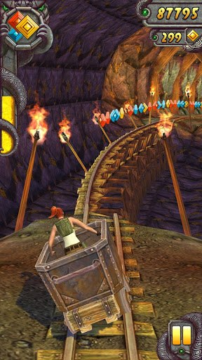

One of the top mobile games, Temple Run is finally coming to Windows Phone. Microsoft is actually bit late with this popular game. The original Temple Run has more than 170 million downloads since its launch in 2011, and there is already a Temple Run 2 available for play on iOS and Android.

 

Microsoft just [announced](http://blogs.windows.com/windows_phone/b/wpdev/archive/2013/03/27/new-middleware-makes-porting-games-to-windows-phone-easy.aspx) at this week's Game Developer's conference that Temple Run, along with other titles including Chaos Rings, Gravity Guy 2, 6th Planet, Propel Man, Fling Theory, Orcs Must Survive, Ruzzle and Drift Mania Championship 2 will soon be available on Windows Store.

**Update:** Temple Run is now available in the [Windows Phone Store](http://www.windowsphone.com/en-us/store/app/temple-run/1a7cb5f8-792a-4992-b07a-83874c0795ae).
