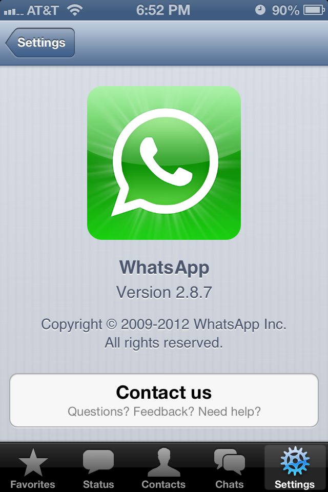

WhatsApp, the popular cross-platform instant messaging application for smart devices, is rumored to close to negotiating a landmark acquisition deal with Google. Sources reportedly close to the negotiations claim that Google is considering a whopping $1 billion dollars on the popular service had 200 million users, as of March 2013.

[DigitalTrends](http://www.digitaltrends.com/social-media/google-acquiring-whatsapp/) reports,

> _“we’ve been told that WhatsApp is ‘playing hardball’ and jockeying for a higher acquisition price, which currently is ‘close to’ $1 billion right now.”_

For WhatsApp, Google’s reach would mean rapid adoption, especially on Android devices. More importantly, the software would probably gain video chatting. What do you think of this reported acquisition?
