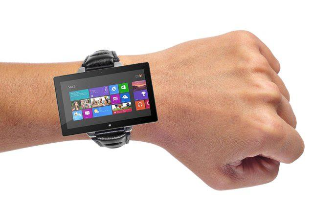

There has been a lot of ink spilled on rumored offerings expected to be coming from Apple, Samsung, LG and now Microsoft. According to the Wall Street Journal, Microsoft is also working with suppliers on designs for touch enabled watch device.

 

According to the [report](http://online.wsj.com/article/SB10001424127887324485004578423522275087936.html), Microsoft is working on designs for smart-watch and asked Asian suppliers to send over components. One of the executives who work for the suppliers claims that Microsoft was asking for 1.5 inch displays.

However, things weren't always so promising for this watch market. About 10 years ago, Microsoft developed a smartwatch that for a subscription fee, would have news headlines, sports scores and IMs sent via FM to its display. But the smartphone business was just starting to take off and the watch was no longer sold after 2008.

Remember Zune? A portable media player made by Microsoft which was an attempt at 'iPod killer' and it is no more. Will Microsoft Smartwatch lead the market?
