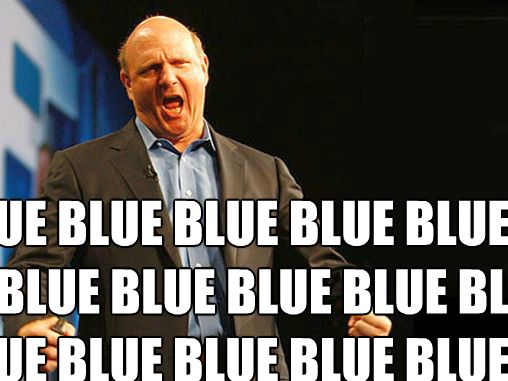

Microsoft confirms long [rumored](http://icosmogeek.com/next-gen-microsoft-office-is-codenamed-gemini/) Windows update - Blue. In a post, Microsoft confirmed that the Windows Blue update will be coming later this year and will allow Windows 8 to run on a number of different sized devices that will be able to combine the capabilities of a PC with some criticisms of Windows 8 and Windows RT.

 

Microsoft’s Tami Reller said in a blog post,

> _“It will deliver the latest new innovations across an increasingly broad array of form factors of all sizes, display, battery life and performance, while creating new opportunities for our ecosystem.”_

Reller also pointed out that the number of apps in the Windows Store has increased 6 times since launch, offering more apps than iOS had available after its first year. She also passed along the news that 250 million Windows Store apps have been downloaded.

Finally, Microsoft said that 100 million licenses have been sold for Windows 8, up from the 60 million licenses sold by January. This figure includes licenses that are shipped along with a new PC or tablet, as well as devices updated to Windows 8.

[\[Read More\]](http://blogs.windows.com/windows/b/bloggingwindows/archive/2013/05/06/windows-8-at-6-months-q-amp-a-with-tami-reller.aspx)

**Update, May 7, 2013:** Just [announced](http://blogs.windows.com/windows/b/bloggingwindows/archive/2013/05/07/julie-larson-green-at-the-wired-business-conference.aspx): Public preview of "Windows Blue" available at the Build Conference at the end of June.
