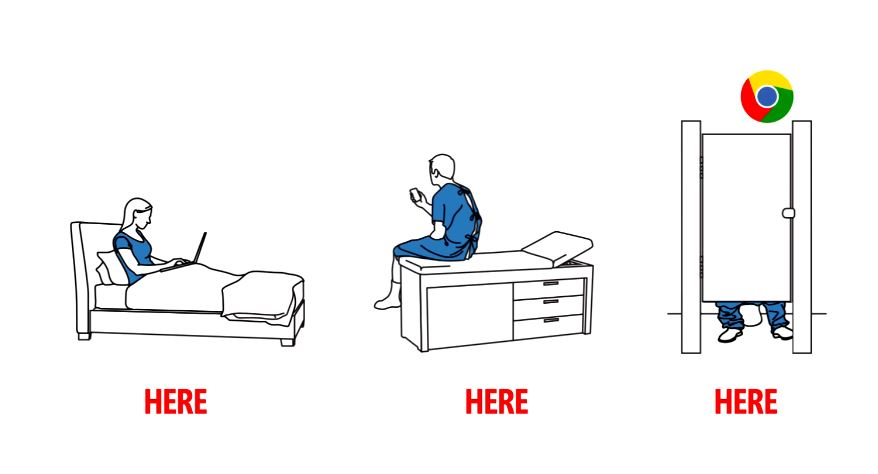

On the same day Google CEO Larry Page spoke out against "negativity" in the tech industry, we've just come across an internal Microsoft video criticizing Google Chrome 'Now Everywhere' video.

Larry Page said:

> _“I’ve personally been quite sad at the industry’s behavior around all these things. If you take something as simple as IM, we’ve had an open offer to interoperate forever....Just this week Microsoft took advantage of that by interoperating with us. You can’t have people milking off of just one company.”_

Here is the original Google Chrome video:

<iframe src="http://www.youtube.com/embed/bEFNh4qEJTA" width="560" height="315" frameborder="0" allowfullscreen="allowfullscreen"></iframe>

 

Microsoft's internal video criticizing above video:

<iframe src="http://www.youtube.com/embed/-Cr6AgUo764" width="560" height="315" frameborder="0" allowfullscreen="allowfullscreen"></iframe>

Is Page right? Should Microsoft stop bashing Google?

\[Video Source\]: GeekWire
