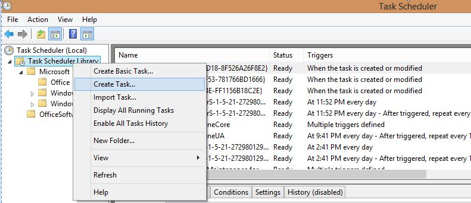
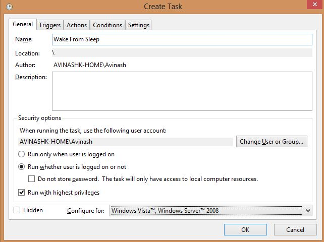
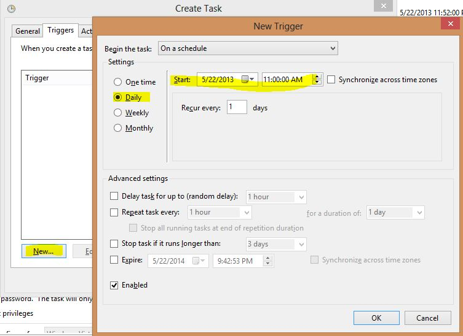
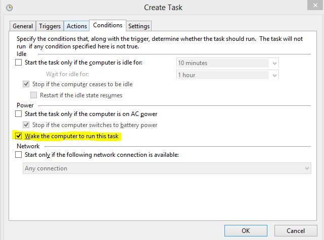
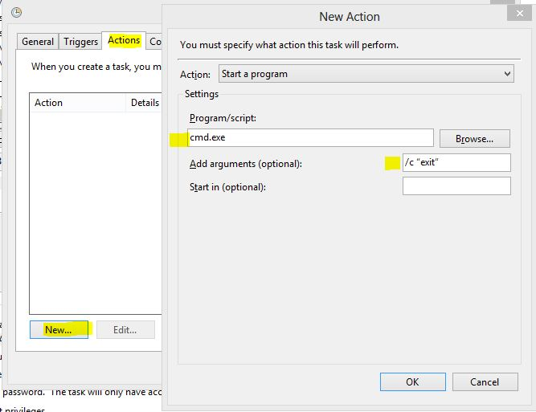
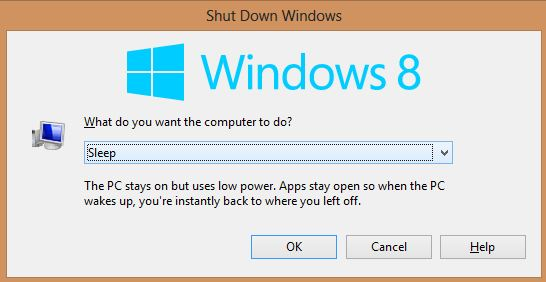
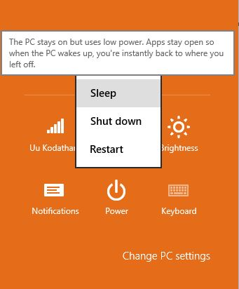

Have you ever wondered whether you can wake up your PC automatically without actually pressing the power button? This can be useful in scenarios where you want to perform heavy downloads in off-peak hours or other similar actions before you wake up in the morning, without running your computer all the night!

\[[Credit](http://www.flickr.com/photos/strandell/2446408542/)\]

Follow these step by step procedure to wake your PC from sleep automatically:

Step 1: Open **Task Scheduler** by searching for it in Start Menu

Step 2: In the Task Scheduler window, click **Create Task**

Step 3: Name the task as shown below or any other desired name. I prefer to select other options to run this task whether the user is logged in or not and run with higher privileges.

Step 4: Click the **Triggers** tab and create a new trigger. Set options at your own desired schedule as below:

Step 5: Click the **Conditions** tab, and check **'Wake the computer to run this task'.**

Step 6: A scheduled task cannot run without at least one task. You could have any simple task like opening a notepad or any file-downloading program or torrent program. In this example, I am running a command prompt with the exit arguments so that it will open and immediately close it - doing nothing. To do this, type **cmd.exe** in Program/script and **/c "exit"** arguments as shown below:

**Finally, save your task and close it.** 

If you want to disable this whole thing, just **delete** the above created task by right clicking on it, of course from **Task Scheduler.**

From next time, your PC will wake up automatically at your desired time. Now, this procedure will work only if you put your computer in sleep mode. That is , the computer won't wake up if it's shut down completely. You can also change power options from Control Panel to have PC automatically sleep after it hasn't been used for a while or when you press specific buttons.

The following are some of the screenshots to put your computer sleep instead of normal shutdown.

Wake On LAN is another method you can use to wake computers, but it works only over the network.
