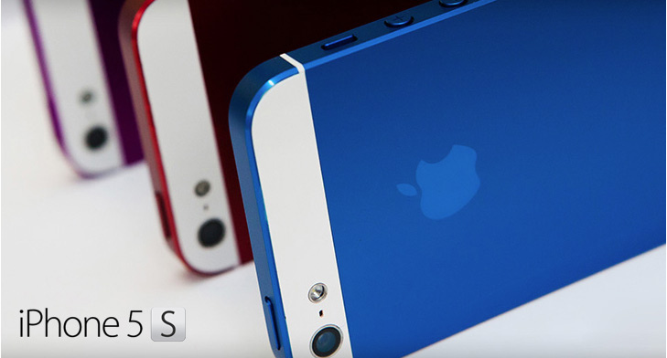

The latest and greatest iPhone is just around the corner.  Whether the next release is the iPhone 5s or iPhone 6 remains to be seen, but there are several improvements that are almost guaranteed to be seen. There are also many concept videos circulating around the Internet. Below are some of the improvements you can expect with the next release of the iPhone this summer.

\[[Credit](http://www.flickr.com/photos/12905355@N05/8338852316/)\]

**Similar Design as iPhone 5**

If Apple holds true to their pattern since 2008, chances are that the next iPhone will have a design very similar to the [iPhone 5](http://icosmogeek.com/iphone-5-unboxing-and-comparison-pictures/).  Their pattern the last few years has been to release phones on odd number years with upgraded internal hardware but little change to the exterior hardware.

**iOS 7**

iOS 6 did not exactly set the world on fire with its release, but this time around Jonathan Ive is in charge of the next set of upgrades and the chances of an improved iOS increased when he took over.  Expect an upgrade to Siri and Apple Maps as well and knocking out some of the bugs from the last release.

**Lower Cost**

Asking users to pay $200 to $400 for the next iPhone could potentially spell disaster for the new release considering that comparable Android devices are selling much cheaper.  Considering that Apple already had to slash prices in China and Brazil in order to compete, expect the same for the next release.

**Improved Processor**

Some leaked photos from iOSDoc have hinted at the possibility of a processor upgrade for the next iPhone.  Odds are that the A6 dual-core processor will be replaced with the A7 quad-core.  Most users won't see a big performance issue but those that play graphic intensive [iPhone gaming apps](http://www.casinotop10.net/Best-iPhone-Slots-Apps), watch HD movies, or run apps using a high processor load will see a huge improvement.

**Camera Improvements**

Considering that Apple always tweaks with their camera a bit with each upgrade, expect much the same with this release.  The main improvement that we should expect is an upgrade to a 13 megapixel camera.

Do you expect any other major improvements?
