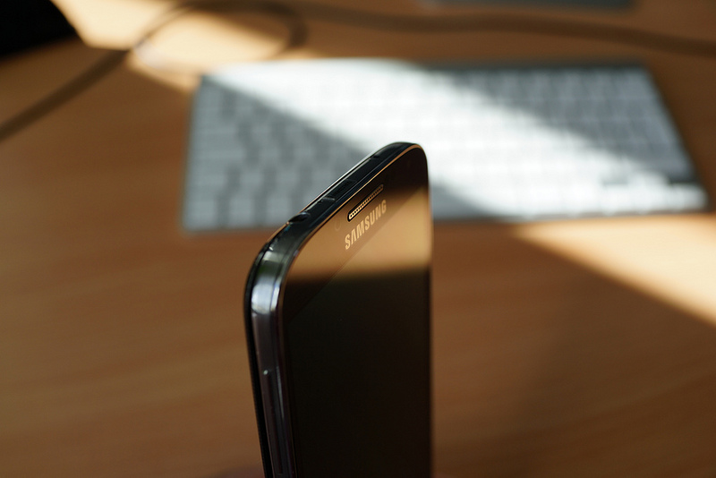
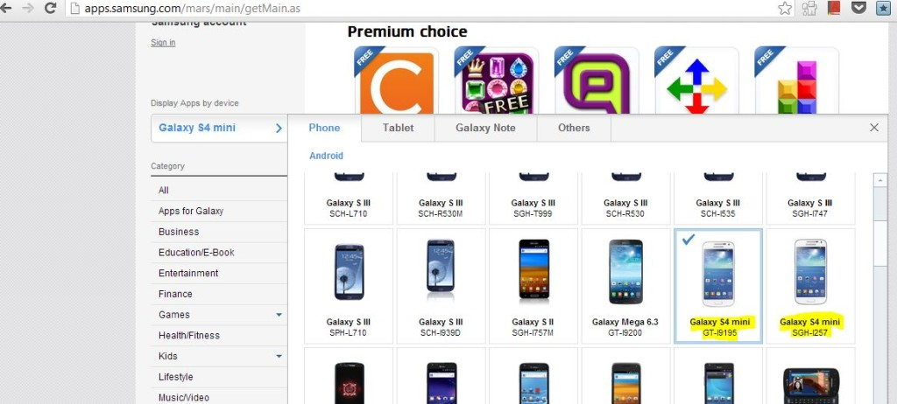

Samsung has not yet announced the rumored Galaxy S4 mini device. But, the handset has shown up accidentally in the company's website.

\[[Credit](http://www.flickr.com/photos/janitors/8678233980/sizes/c/)\]

Originally spotted by [TGSpot](http://www.tgspot.co.il/galaxy-s4-mini-pop-up-in-samsung-apps-website/), Samsung's app site over [here](http://apps.samsung.com/mars/main/getMain.as) allows you to sort apps by device which let you see a glance of all apps of your device. The following screenshot clearly shows Samsung S4 mini listed as S4 Galaxy mini GT-I9195 and SGH-I257 in one of those devices.

According to leaked images and reports, S4 mini is expected to be slightly smaller than current Galaxy S4, reducing the screen size from 5 inches to 4.3 inches.
