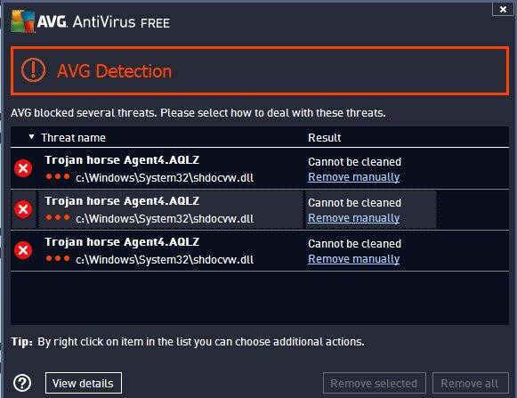
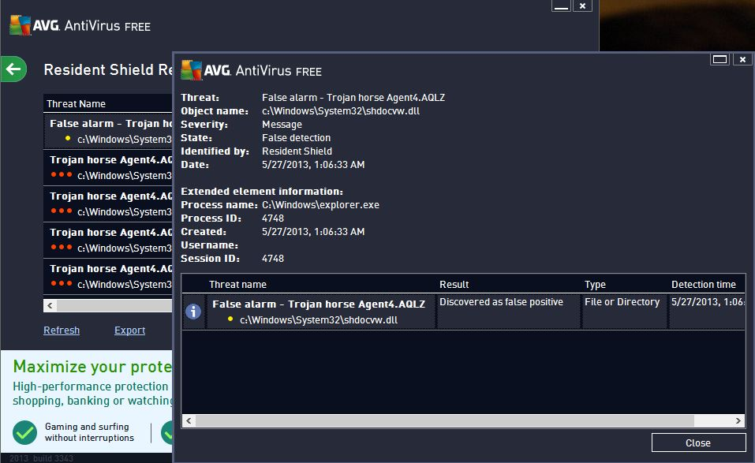

Few hours ago (late Sunday), I saw the following alert message from AVG antivirus on my Windows 8 computer related to **Trojan horse: Agent4.AQLZ** and **shdocw.dll** file. Upon further research on the Internet, I found that this problem is currently faced by thousands of AVG users about virus detection which possibly is a false Trojan Horse alarm by AVG.

The antivirus program continues to pile up above virus detection messages whenever you browse windows explorer. After this alert, I attempted to create AVG rescue disk as suggested by help page and followed instructions accordingly. I completely scanned my computer from the rescue disk with no luck.

Thousands of AVG users have reported on the company's official Facebook [page](https://www.facebook.com/avgfree/posts/10151436188608663). The community moderator is taking time to reply users individually asking to stay tuned for further updates from the company. Furthermore, the representative is also asking users to provide sample of detected files to analyse this problem over [here](http://www.avg.com/us-en/faq.num-2343).

For now, I would recommend everyone to ignore this false positive message from AVG antivirus and not to delete any system files.

**Update:** AVG officially confirmed that this is discovered as false positive alarm and issued a fix as a definition update.

I personally verified it by updating the antivirus program and rebooting the computer. Once rebooted, you should get a message mentioning **shdocvw.dll** system file is safe and the program discovered as false positive. You can also view this message from _Options > History > Resident Shield Results_ of the AVG Free program.

