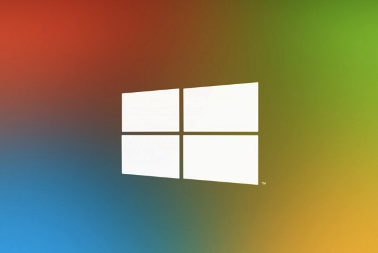
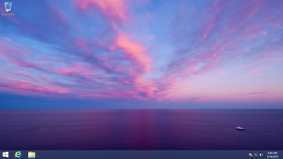
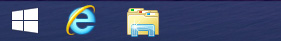

Welcome back **Start Button**! Microsoft seems to be really listening to Windows 8 users. We now have a leaked screenshot of the latest Windows 8.1 preview leaked build.

Paul Thurrott from [WinSuperSite](http://winsupersite.com/windows-8/blue-start-experience-changes) posted some screenshots showing the brand new Start button fashioned as a Windows 8 icon.

> _When you hover over Start button, the button changes color, with a black background and the accent color used on the flag logo. Yes, it looks exactly like the Start Charm, with similar animations_.

The post also confirms that Windows 8.1 will allow users to boot directly to desktop mode, although he says that Microsoft has turned off that option by default. Rejoice with following images:

 

And yes, there seems to be an option to boot to desktop directly instead of Modern (aka Metro) UI and it's off by default. Are you excited to upgrade?
