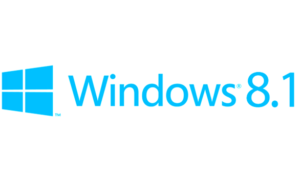
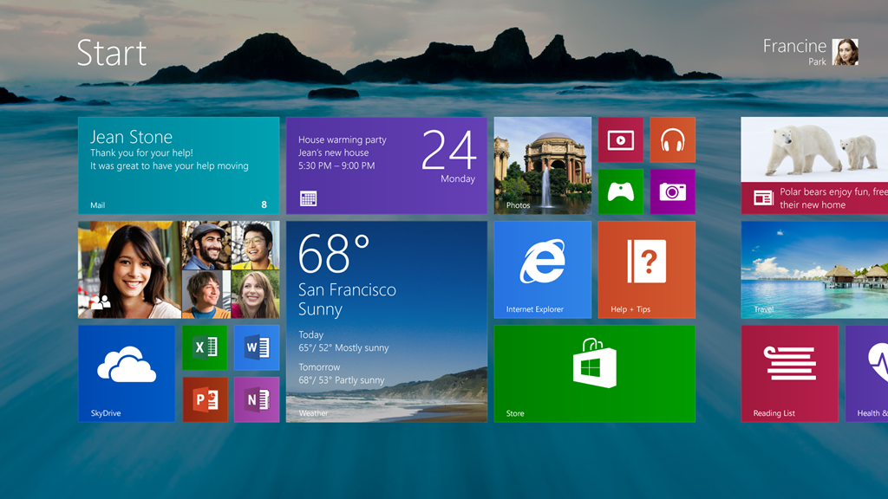
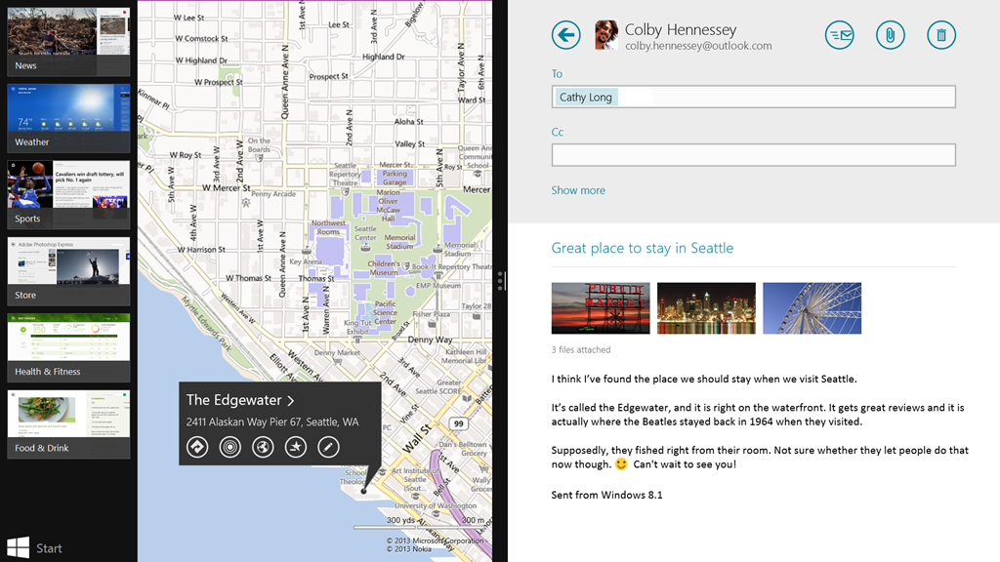
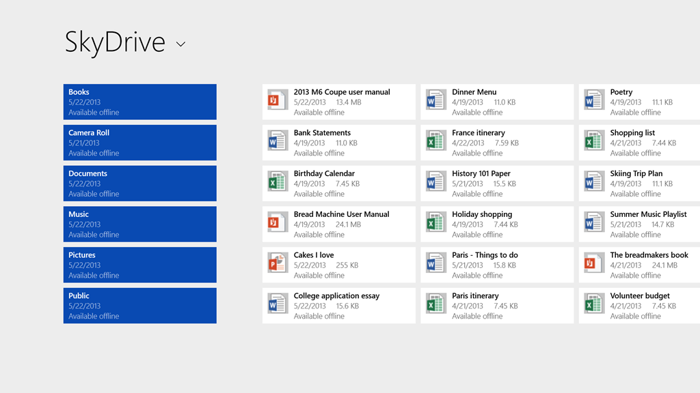

Windows 8.1 update is coming soon and Microsoft officially discussed several things about the new changes that are going to be available in this update. Major improvements include Start Button, Boot to Desktop, IE 11, deep SkyDrive integration, etc. This update is free to Windows 8 users and preview build is expected to be released sometime around June 26. Carry on reading to find out what’s new in Windows 8.1.

**UI Improvements:**

1. As [previously rumored](http://icosmogeek.com/start-button-is-back-in-leaked-windows-8-1/), Start Button is back! 
2. New Live Tile sizes: Windows 8.1 offers extra small and extra large size for live tiles.
3. Auto app updates
4. Boot to Desktop: Windows 8.1 users will not have an option to boot directly into desktop instead of modern UI
5. Desktop background image on Start

**New Features:**

1. Improved and global search
2. IE11
3. You can now snap more than 2 apps.
4. Active lock screen that can do things like display image slides, take a Skype call without unlocking the device
5. App sync across devices
6. Deeper SkyDrive integration
7. Small screen support

More details and screen shots from official post [over here](http://blogs.windows.com/windows/b/bloggingwindows/archive/2013/05/30/continuing-the-windows-8-vision-with-windows-8-1.aspx). Are you excited with the new features in Windows 8.1? Share your thoughts in the comments below:

