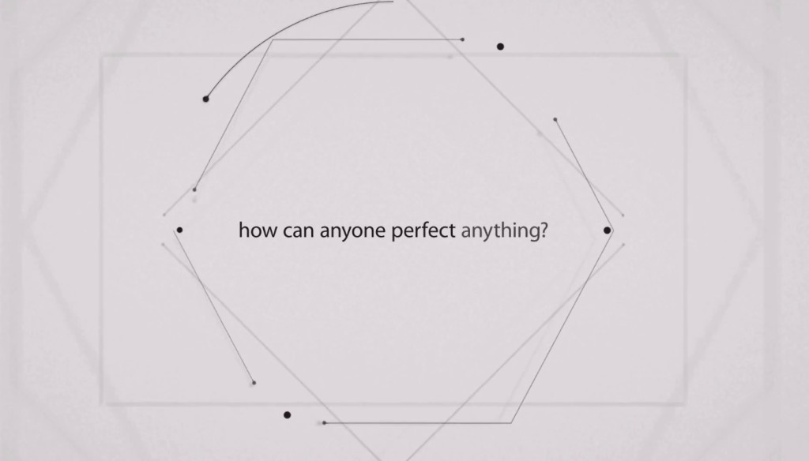

When Steve Jobs passed away on October 5, 2011, everybody raised a question - how will Apple survive without him? Apple answered all those critics in a remarkable video Jobs' mission statement towards innovation.

Titled "Designed By Apple – Intention," the video displays words set against simple design patterns and its definitely worth a watch!

The simple words in the video (at the end of the post) appears to be a message to consumers of the company's product quality and more of direct answer to media, tech industry and everyone. The company just answered its competitors like Samsung who make more phones and throw in every feature they can think of to innovate them. Apple doesn't work in that way and won't rush things to market.

We can see this attitude throughout the whole [WWDC 2013](http://www.apple.com/apple-events/june-2013/) keynote presentation. Particularly, Phil Schiller unveiling the new Mac Pro said - _"Can't innovate any more, my ass!"_

It says -

> _If everyone is busy making everything, how can anyone perfect anything?_
> 
> _We start to confuse convenience with joy,  abundance with choice._
> 
> _Designing something requires focus._
> 
> _The first thing we ask: What do we want people to feel? Delight. Surprise. Love. Connection._
> 
> _Then we craft around our intention. It takes time._
> 
> _There are a thousand no’s for every yes._
> 
> _We simplify. We perfect._
> 
> _We start over, until everything we touch enhances every life it touches._
> 
> _Only then do we sign our work._
> 
> _– Designed by Apple in California._

This is the best animation video I've seen during recent days. Did you like the video?

<iframe src="http://www.youtube.com/embed/VpZmIiIXuZ0" height="315" width="560" allowfullscreen frameborder="0"></iframe>

 

Bonus Video: Apple's one more video about experience:

<iframe src="http://www.youtube.com/embed/Zr1s_B0zqX0" height="315" width="560" allowfullscreen frameborder="0"></iframe>
