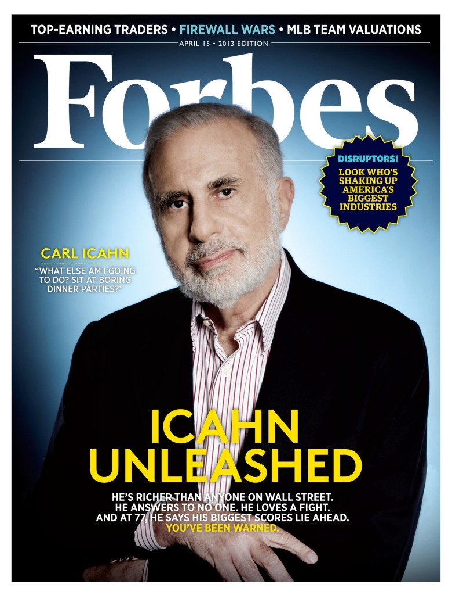

This shows the power of Twitter. Or just the power of a billionaire on Twitter. At around 2:20 p.m. ET, legendary investor Carl Icahn tweeted that he has a huge stake in Apple and then the stock jumped!

Apple's shares, which had been trading at $475.77 went vertical, gaining nearly $9 in less than 3 minutes. By 3:35 p.m. they had touched $494.66.

This is the first tweet:

<blockquote class="twitter-tweet">We currently have a large position in APPLE. We believe the company to be extremely undervalued. Spoke to Tim Cook today. More to come.

— Carl Icahn (@Carl_C_Icahn) <a href="https://twitter.com/Carl_C_Icahn/statuses/367350206993399808">August 13, 2013</a></blockquote>

That was followed four minutes later with this tweet:

<blockquote class="twitter-tweet">Had a nice conversation with Tim Cook today. Discussed my opinion that a larger buyback should be done now. We plan to speak again shortly.

— Carl Icahn (@Carl_C_Icahn) <a href="https://twitter.com/Carl_C_Icahn/statuses/367351130776285184">August 13, 2013</a></blockquote>How many shares Icahn purchased, and what he plans to do with them -- besides watch their price rise just because he tweeted about them -- all remains for now a mystery.

Carl Icahn holds a 16% stake in Apple’s Siri partner Nuance Communications. He also acquired a 10% stake in Netflix and has previously taken stakes and pushed for changes at Motorola and Yahoo. \[Read [Wikipedia](http://en.wikipedia.org/wiki/Carl_Icahn) for more\]

What's your comment? Is Icahn simply looking to increase his shareholder value or initiate a coup against Tim Cook and the Apple leadership? May be! His Twitter bio line describes:

> _"Some people get rich studying artificial intelligence. Me, I make money studying natural stupidity"._
