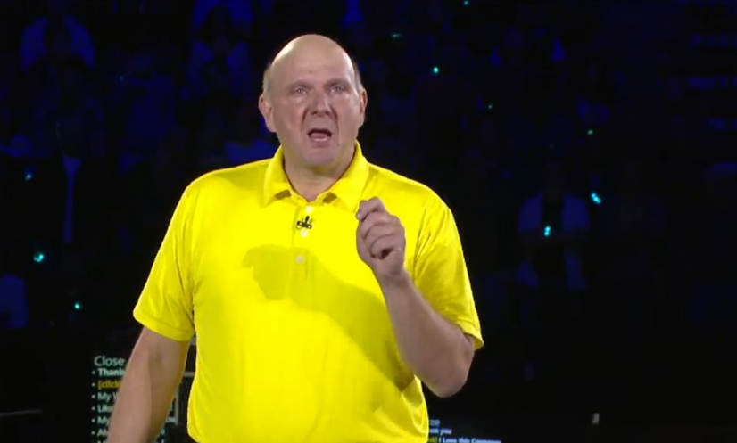

Microsoft's CEO Steve Ballmer is one of the world's hardest charging executives. He moved to tears on Thursday which is likely his last annual company meeting with employees.

This video to 13,000 Microsoft employees in Seattle shows him crying as he says farewell after 13 years as CEO of the company and another 20 years by founder Bill Gates' side before that.

A couple of months ago, Microsoft confirmed that he would be retiring in couple of months and the company is in the search for a new CEO.

Ballmer says, _"Soak it in all of you. You work for the greatest company in the world. And I want to say thank you, thank you, thank you, thank you..."_  Finally he exits the stage roaring his thanks to the crowd and jumping for high fives, to the song "The Time of My Life" from the movie 'Dirty Dancing'.

Watch the video below and it's definitely worth watching.

<iframe width="640" height="480" src="//www.youtube.com/embed/E7llUx3O6B8?rel=0" frameborder="0" allowfullscreen></iframe>

\[[via](http://www.theverge.com/2013/9/27/4779142/steve-ballmer-microsoft-departure-speech)\]
