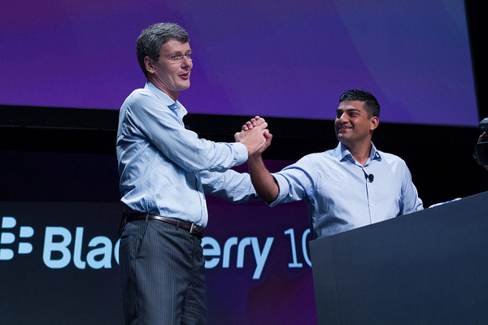

In a bit of a surprise move, BlackBerry announced this morning that it has given up on its effort to sell itself to a large investor, and that it will be replacing Thorsten Heins with former Sybase chief John Chen as interim CEO.

 

From the [official press release](http://press.blackberry.com/financial/2013/blackberry-receives-investment-of-u-s---1-billion--from-fairfax-.html):

> _“BlackBerry (Nasdaq: BBRY; TSX: BB), a world leader in the mobile communications market, today announced that it has entered into an agreement pursuant to which Fairfax Financial Holdings Limited (“Fairfax”) and other institutional investors (collectively, the “Purchasers”) will invest in BlackBerry through a U.S. $1 billion private placement of convertible debentures.  Fairfax has agreed to acquire U.S.$250 million principal amount of the Debentures.  The transaction is expected to be completed within the next two weeks...."_
> 
> _“Upon the closing of the transaction, John S. Chen will be appointed Executive Chair of BlackBerry’s Board of Directors and, in that role, will be responsible for the strategic direction, strategic relationships and organizational goals of BlackBerry. Prem Watsa, Chairman and CEO of Fairfax, will be appointed Lead Director and Chair of the Compensation, Nomination and Governance Committee and Thorsten Heins and David Kerr intend to resign from the Board at closing._
> 
> _In addition, Mr. Heins will step down as Chief Executive Officer at closing and Mr. Chen will serve as Interim Chief Executive Officer pending completion of a search for a new Chief Executive Officer.”_

\[[Read More](http://dealbook.nytimes.com/2013/11/04/blackberry-abandons-effort-to-sell-itself-c-e-o-to-step-down/?hp&_r=0)\]
