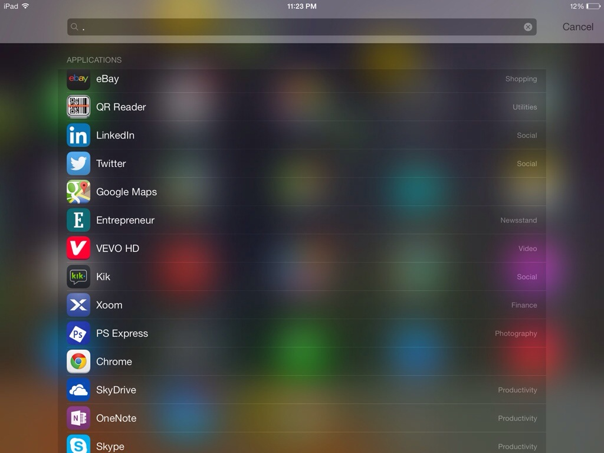

If you want to quickly list out all your apps on your iOS 7 device, here is a quick tip. All you need to do is - open Spotlight search by swiping down while you are on home screen and then type **.** in the search bar. Yes, that's the period symbol. This should provide a list of each and every app installed on your device.

  
  

If you want to customize what needs to be shown in the above screen search, change it from Settings > General > Spotlight Search.
