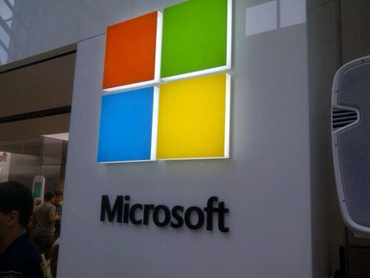

  
  
Reuters is reporting that the company now has a shortlist of just about five names, including Ford CEO Alan Mulally, former Nokia CEO Stephen Elop, Microsoft cloud boss Satya Nadella, and former Skype president Tony Bates.

[Read more](http://www.reuters.com/article/2013/11/06/us-microsoft-ceo-idUSBRE9A500A20131106)
