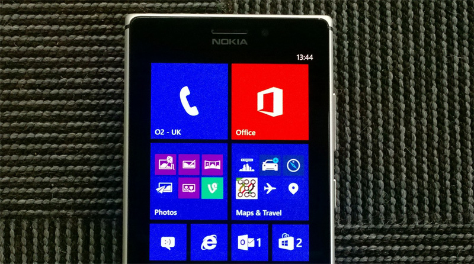

From today, Nokia is rolling out new Lumia Black software update bringing new App Folder interface that allows Windows Phone users to stack apps and settings into a folder Tile on the Start Screen. This update is first scheduled to roll out to  Lumia 1020 and and Lumia 925 devices from today. Other Lumia models will be updated in next coming weeks.

Other bunch of updates include - rotation lock, custom tones for messages, emails, and reminders, and a new Driving Mode feature that’s designed to limit notifications while you’re driving. Multitasking improvements, including the ability to close apps, are also included.

<iframe src="//www.youtube.com/embed/JzxSo-pI-YE" height="315" width="560" allowfullscreen frameborder="0"></iframe>

\[[Read More](http://conversations.nokia.com/2014/01/09/lumia-black-update/)\]
