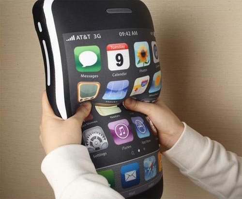

Rejoice, people who want iPhones with big screens! Apple is finally ready to join the rest of the world's smartphone makers by making a bigger iPhone.

The Wall Street Journal says Apple is making an iPhone with a screen that's larger than 4.5-inches. It's also working on a second iPhone with a screen that's bigger than 5-inches. Right now, Apple's iPhone 5S and iPhone 5C have 4-inch screens. The iPhone 4S has a 3.5-inch screen.

Additionally, the Journal says Apple is scrapping the iPhone 5C's plastic style. The new phones are going to be metal like the iPhone 5S.

\[[Read More](http://online.wsj.com/news/articles/SB10001424052702304856504579338611620927036?mod=wsj_nview_latest)\]
