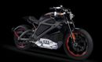

Harley-Davidson Project LiveWire, its first electric motorcycle revealed.  
  
Battery life of the current prototype is good for around 53 miles, and as for the motor itself, that musters 74HP and 52 lb-ft of torque. The bike is limited to 92mph at most, and uses regenerative braking like electric cars to restore energy to the batteries when slowing.  
  
Check out more:  
[https://www.youtube.com/watch?v=t6F8O5A\_\_Ds](https://www.facebook.com/l.php?u=https%3A%2F%2Fwww.youtube.com%2Fwatch%3Fv%3Dt6F8O5A__Ds&h=IAQHwVb2L&s=1)  
[http://project.harley-davidson.com/en\_US](http://l.facebook.com/l.php?u=http%3A%2F%2Fproject.harley-davidson.com%2Fen_US&h=oAQGaXY2z&s=1)  
  

