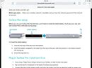

Oops! Microsoft accidentally confirms existence of Surface Mini in this user manual.  
  
"You’ll pair your new pen with Surface Mini a little later during setup," suggests one section on the new Surface Pen, while two other parts of the user manual reference the Surface Mini when using OneNote and the rotation lock features of Windows 8. 
  
Check out yourself: [http://download.microsoft.com/download/F/0/D/F0D07CB4-EE57-472E-AB46-CE0D9B3463D7/Surface-Pro-3-User-Guide-English.pdf](http://l.facebook.com/l.php?u=http%3A%2F%2Fdownload.microsoft.com%2Fdownload%2FF%2F0%2FD%2FF0D07CB4-EE57-472E-AB46-CE0D9B3463D7%2FSurface-Pro-3-User-Guide-English.pdf&h=tAQEji01o&s=1)  
  

