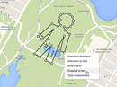

Google Maps now lets you measure distances between two or more points. You can now right click anywhere on Google Maps on the web and choose "measure distance" to bring up a digital ruler that'll tell you just how far away its final point is.  
  
[https://support.google.com/maps/answer/1628031](https://www.facebook.com/l.php?u=https%3A%2F%2Fsupport.google.com%2Fmaps%2Fanswer%2F1628031&h=xAQGzp4TE&s=1)  
  

