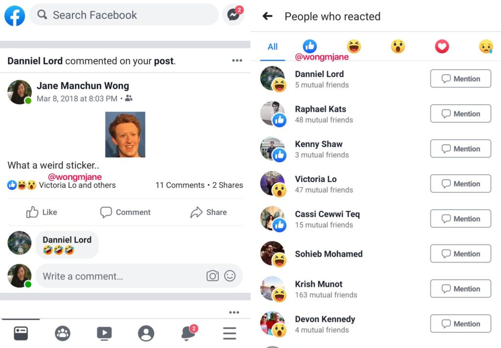

Facebook confirms it may follow Instagram and hide like counts. 

Users might feel less anxious about the perceived popularity of their content. Studies have shown that social media use may influence mental health, including leading to depression and anxiety. 

