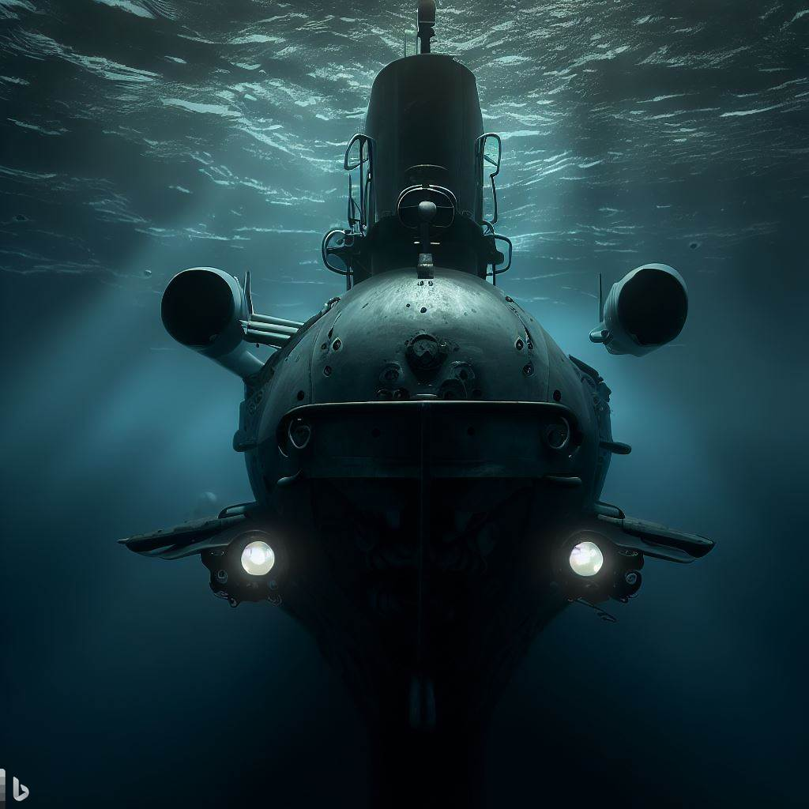

Submarines are amazing machines that can travel deep underwater for long periods of time. They can perform various missions, such as military operations, scientific research, or underwater exploration. But how do submarines work and navigate underwater? How do they control their depth, speed, and direction? How do they communicate and locate targets? In this blog post, I will answer these questions and explain the basic principles and technologies behind submarine operation and navigation.

### How Submarines Work

Submarines work by controlling their buoyancy, which is the tendency to sink, rise, or float at a certain depth. They have ballast tanks that can be filled with water or air to make them heavy or light. They also have fins called diving planes that create lift by adjusting the angle of water flow¹.

To dive, a submarine fills its ballast tanks with water, making it heavier than the surrounding water. The diving planes are tilted downward, pushing the nose of the submarine down. The propeller provides forward thrust, making the submarine move forward and downward.

To surface, a submarine blows compressed air into its ballast tanks, forcing out the water and making it lighter than the surrounding water. The diving planes are tilted upward, pushing the nose of the submarine up. The propeller provides forward thrust, making the submarine move forward and upward.

To maintain a constant depth, a submarine balances its buoyancy and lift by adjusting the amount of water and air in its ballast tanks and the angle of its diving planes. A device called a depth gauge measures the water pressure and indicates the depth of the submarine. A device called a depth controller automatically regulates the buoyancy and lift to keep the submarine at a desired depth¹.

### How Submarines Navigate Underwater

Submarines navigate underwater by using various systems and methods to determine their position, direction, speed, and distance traveled. They also use various systems and methods to detect and identify objects or obstacles in their surroundings. Some of these systems and methods are:

- **Inertial navigation system (INS)**. This is a self-contained system that measures the motion of the submarine using accelerometers and gyroscopes. It calculates the position, orientation, and velocity of the submarine relative to a known starting point. It does not rely on radio signals or celestial sightings, so it allows the submarine to navigate while remaining hidden under the surface. However, it is subject to errors over time due to drifts or biases in the sensors¹².

- **Global positioning system (GPS)**. This is a satellite-based system that provides accurate position and time information to receivers on Earth. It uses signals from multiple satellites to triangulate the location of the receiver. It is very accurate and reliable, but it requires a clear line of sight between the receiver and the satellites. Therefore, it can only be used when the submarine is on the surface or at periscope depth¹².

- **Radio navigation systems**. These are terrestrial-based systems that use radio signals from fixed transmitters to determine the position of receivers on Earth. They use different methods such as hyperbolic navigation or Doppler navigation to calculate the distance or direction of the receiver from the transmitters. They are less accurate and reliable than GPS, but they can work underwater to some extent depending on the frequency and power of the signals²³.

- **Celestial navigation**. This is an ancient method that uses observations of celestial bodies such as stars, planets, or the Sun to determine the position and direction of an observer on Earth. It requires a clear view of the sky and a device such as a sextant or a periscope to measure angles between celestial bodies and the horizon. It also requires tables or charts to convert angles into coordinates. It is rarely used by modern submarines due to its complexity and limitations²³.

- **Radar navigation**. This is a method that uses radar signals to measure distances or directions between objects or landmarks on Earth. Radar signals are electromagnetic waves that reflect off surfaces such as land, sea, or air. A radar system consists of a transmitter that emits radar signals and a receiver that detects radar signals reflected by targets. By measuring the time delay or frequency shift of the signals, it can calculate the range or bearing of the targets²³.

- **Sonar navigation**. This is a method that uses sonar signals to measure distances or directions between objects or landmarks underwater. Sonar signals are sound waves that travel through water and reflect off surfaces such as the sea floor, the sea surface, or other submarines. A sonar system consists of a transducer that emits and receives sonar signals and a processor that analyzes the signals. By measuring the time delay or frequency shift of the signals, it can calculate the range or bearing of the targets²³.

### How Submarines Communicate and Locate Targets Underwater

Submarines communicate and locate targets underwater by using various systems and methods that involve sending or receiving signals through water. Some of these systems and methods are:

- **Radio communication systems**. These are systems that use radio signals to transmit or receive information such as voice, data, or images through water. Radio signals are electromagnetic waves that can propagate through water to some extent depending on the frequency and power of the signals. However, radio signals are easily attenuated or distorted by water, so they can only be used for short distances or at low frequencies²³.

- **Satellite communication systems**. These are systems that use satellite signals to transmit or receive information such as voice, data, or images through water. Satellite signals are electromagnetic waves that can propagate through water to some extent depending on the frequency and power of the signals. However, satellite signals are easily attenuated or distorted by water, so they can only be used when the submarine is on the surface or at periscope depth²³.

- **Acoustic communication systems**. These are systems that use sound waves to transmit or receive information such as voice, data, or images through water. Sound waves are mechanical waves that can propagate through water with less attenuation or distortion than electromagnetic waves. However, sound waves are also affected by factors such as water temperature, salinity, pressure, currents, noise, or interference²³.

- **Active sonar systems**. These are systems that use sound waves to detect and identify targets underwater. Active sonar systems emit sound waves and listen for echoes from targets. By measuring the time delay or frequency shift of the echoes, they can calculate the range, bearing, speed, and shape of the targets. Active sonar systems can provide accurate and detailed information about targets, but they also reveal the position and presence of the submarine²³.

- **Passive sonar systems**. These are systems that use sound waves to detect and identify targets underwater. Passive sonar systems listen for sound waves emitted by targets or their surroundings. By analyzing the frequency, intensity, direction, and pattern of the sound waves, they can determine the type, location, movement, and activity of the targets. Passive sonar systems can provide stealthy and continuous information about targets, but they also have limited range and resolution²³.

### Conclusion

Submarines are amazing machines that can travel deep underwater for long periods of time. They work by controlling their buoyancy and lift using ballast tanks and diving planes. They navigate underwater by using various systems and methods such as inertial navigation system, global positioning system, radio navigation systems, celestial navigation, radar navigation, and sonar navigation. They communicate and locate targets underwater by using various systems and methods such as radio communication systems, satellite communication systems, acoustic communication systems, active sonar systems, and passive sonar systems.

If you are interested in learning more about submarines and their operation and navigation, you can check out these sources:

- (1) How do submarines work? - Explain that Stuff. https://www.explainthatstuff.com/submarines.html.

- (2) How do the submarines navigate underwater? - Naval Post- Naval News and …. https://navalpost.com/how-submarine-navigate-underwater/.

- (3) Submarine navigation - Wikipedia. https://en.wikipedia.org/wiki/Submarine\_navigation.

_Note: Some contents of this post including image has been generated using AI._
