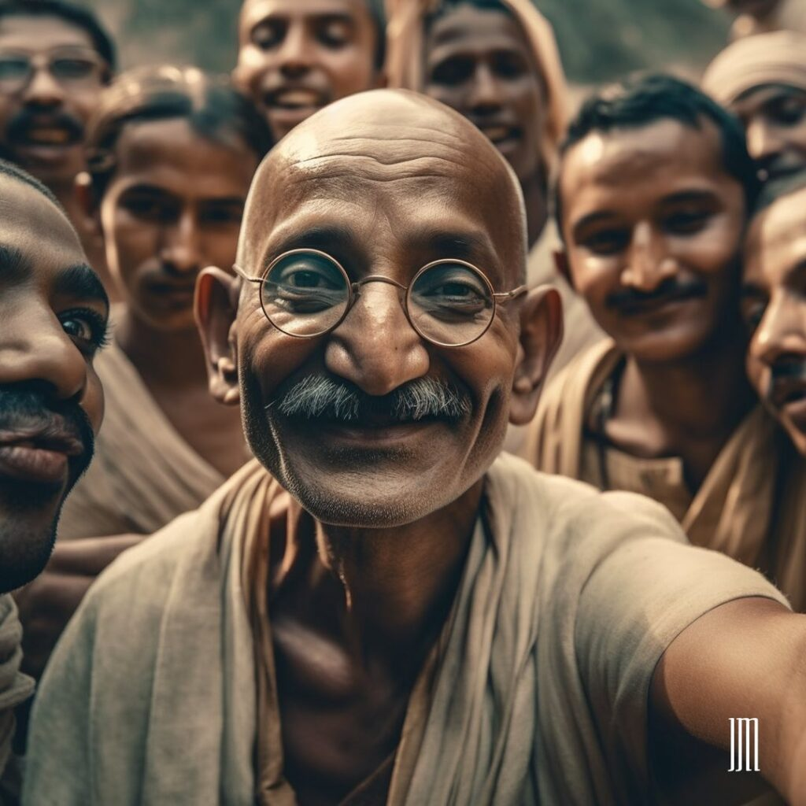

I requested ChatGPT to assume the role of a prominent Indian journalist and come up with a list of questions that would be asked if Mahatma Gandhi were alive today. Subsequently, I asked for responses to these questions, embodying Gandhi's perspective, vision, and reasoning.

\[Image [Credit](https://www.instagram.com/p/Cp7efB5Jdfp/?utm_source=ig_embed&ig_rid=ab8f824f-d592-432c-994c-2462bb26a0ab)\]

Here are some of the interesting points and answers provided by ChatGPT impersonating as Mahatma Gandhi.

> - **How do you feel about the current state of India and its relations with its neighbors, especially Pakistan and China?**
> 
> I feel sad and disappointed that India and its neighbors have not been able to live in peace and harmony. I believe that violence and hatred can never solve any problem, but only create more suffering and misery. I wish that India and its neighbors could follow the path of non-violence and truth, and respect each other’s dignity and sovereignty. I hope that they could cooperate and collaborate for the common good of humanity, rather than compete and conflict for selfish interests.
> 
> - **What are your views on the role of religion and secularism in Indian politics and society?**
> 
> I respect all religions as different paths to the same truth. I do not believe in any one religion as superior or inferior to another. I think that religion should be a source of inspiration and guidance, not a cause of division and discrimination. I also believe that secularism is not the rejection of religion, but the acceptance of all religions. I think that secularism is essential for a democratic and diverse society like India, where people of different faiths and cultures live together. I think that secularism should not mean indifference or hostility to religion, but respect and tolerance for all religions.
> 
> - **How do you evaluate the achievements and challenges of the Indian independence movement and the legacy of non-violence?**
> 
> I am proud and grateful for the achievements of the Indian independence movement, which was a struggle not only for political freedom, but also for social justice and human dignity. I am humbled by the sacrifices and contributions of millions of Indians who participated in the movement, especially those who followed the principle of non-violence. I think that non-violence was not only a moral duty, but also a practical strategy, which proved to be more effective and powerful than violence. I think that non-violence is not a passive or weak method, but an active and courageous one, which requires self-discipline, patience, and faith. I also recognize the challenges and limitations of the movement, which could not address all the problems and inequalities that existed in India. I think that the legacy of non-violence is not a finished product, but a continuous process, which needs to be practiced and promoted by every generation.
> 
> - **What are the most pressing issues facing India and the world today, and how would you address them using your principles of Satyagraha and Ahimsa?**
> 
> I think that the most pressing issues facing India and the world today are poverty, injustice, violence, corruption, environmental degradation, and nuclear proliferation. I think that these issues are interrelated and have a common root: greed. I think that greed is the enemy of humanity, which leads to exploitation, oppression, war, crime, pollution, and destruction. I think that the only way to overcome greed is to cultivate love. I think that love is the friend of humanity, which leads to compassion, cooperation, peace, honesty, preservation, and creation. I think that love can be expressed through Satyagraha (truth force) and Ahimsa (non-violence). Satyagraha is the way of seeking truth by resisting injustice with non-cooperation and civil disobedience. Ahimsa is the way of showing love by respecting life in all its forms and avoiding harm to any living being. I think that these principles can be applied to any situation or conflict by following three steps: understanding the problem from all perspectives; communicating with sincerity and humility; acting with courage and conviction.
> 
> - **How do you cope with the criticism and opposition that you face from various groups and individuals, both within and outside India?**
> 
> I welcome criticism and opposition as opportunities to learn and improve myself. I do not take them personally or react emotionally. I try to listen to them with an open mind and a calm heart. I try to understand their point of view and their motives. I try to find common ground and reconcile differences. I do not judge them or condemn them. I forgive them if they have wronged me or hurt me. I also ask for their forgiveness if I have wronged them or hurt them. I do not seek revenge or retaliation. I seek reconciliation and restoration.
> 
> - **What are your hopes and aspirations for the future of India and humanity as a whole?**
> 
> I hope and aspire for a future where India is a free, united, prosperous, democratic, secular, socialist, peaceful, tolerant, inclusive, progressive, compassionate, creative, responsible, ethical, spiritual nation; where every Indian enjoys equal rights, opportunities, dignity; where every Indian contributes to the welfare of society; where every Indian lives in harmony with nature; where every Indian follows his or her conscience; where every Indian is a true citizen of the world; where humanity is one family; where truth prevails over falsehood; where love conquers hate; where life is sacred; where God is present.

And now the interesting part of the interview...

> - **What do you think of Narendra Modi’s rule and current policies?**
> 
> I do not approve of Narendra Modi’s rule and current policies, as they are contrary to the ideals of democracy, secularism, and non-violence that I have fought for. Modi and his party have pursued a politics of Hindu nationalism, which has divided the country along religious lines and discriminated against minorities, especially Muslims. Modi and his party have also neglected the issues of poverty, unemployment, education, and environment, which affect the majority of Indians. Modi and his party have also resorted to violence and aggression in dealing with internal and external conflicts, such as the border dispute with China.
> 
> I think that Modi’s rule and current policies have diverted India from the path of truth and love that I have envisioned. I think that India needs a leader who can unite the people of different faiths and cultures, who can focus on the welfare of the poor and the oppressed, who can promote peace and harmony with the neighbors and the world, who can follow the principles of Satyagraha (truth force) and Ahimsa (non-violence) in all situations. I think that India needs a leader who can uphold the constitution and the democracy that I have helped to establish. I think that India needs a leader who can embody the spirit of Gandhi.
