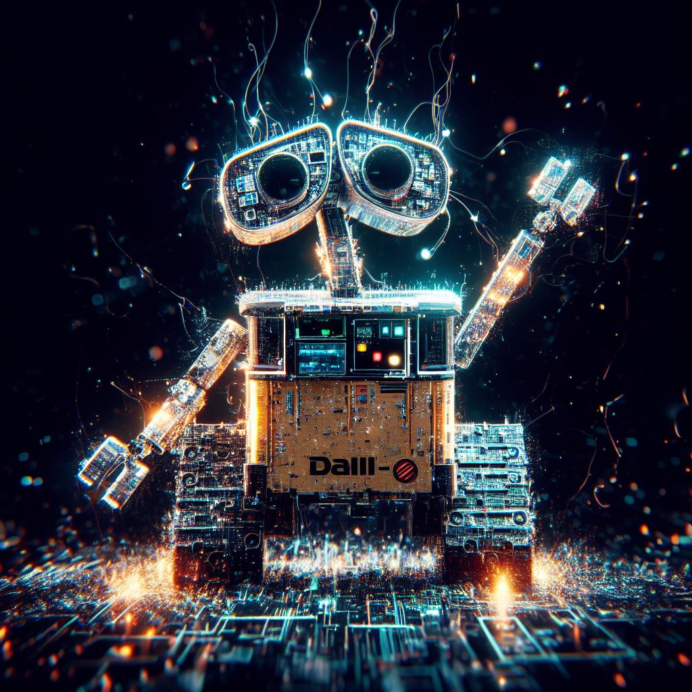

OpenAI, a frontrunner in artificial intelligence research, has recently announced several groundbreaking updates that are set to enhance AI technology interactions in dramatic ways.

**New Voice and Image Features for ChatGPT**

> The beloved AI model, ChatGPT, is now more capable than ever. OpenAI has enhanced ChatGPT with new voice and image features, setting a new standard for AI interactions. This enhancement allows ChatGPT to manipulate images based on voice instructions. This capability is a landmark achievement in the AI realm as it enables the model to interpret and generate text descriptions for images, thereby adding a new dimension to how users interact with AI.

**GPT-4 Vision: Understanding and Creating Images**

> Advancing the frontier of language models, OpenAI announced the release of GPT-4 Vision. This large language model possesses capabilities to understand and generate images, blurring the line between man and machine further. GPT-4 Vision successfully showcases the strides made in the world of AI, even with its identified limitations and operations flaws. Along with its announcement, OpenAI reiterated their commitment to emphasizing AI safety, another crucial aspect of the journey towards creating responsible AI.

**The Evolution of DALL-E: The Third Version**

> The AI visual art generator, DALL-E, has gone through its third evolution with DALL-E 3. The latest version exhibits an improved understanding of context, showing the progress made in AI’s cognitive abilities. OpenAI's consistent emphasis on refining and improving its technology underlines their dedicated pursuit of excellence in the AI field.

OpenAI's latest announcements demonstrate the ever-evolving landscape of artificial intelligence. With each new development, users are granted more engaging ways to interact with AI, standing testament to the promise of a future fueled by AI technology. We await, with bated breath, what OpenAI has to unfold in its next chapter of AI exploration.

To know more, you can read the following references:

1. "[ChatGPT can now see, hear, and speak - OpenAI](https://openai.com/blog/chatgpt-can-now-see-hear-and-speak)"

3. "[OpenAI Announces ChatGPT Voice and Image Features - InfoQ](https://www.infoq.com/news/2023/10/chatgpt-voice-image/)"

5. "[OpenAI releases third version of DALL-E - The Verge](https://www.theverge.com/2023/9/20/23881241/openai-dalle-third-version-generative-ai)"
